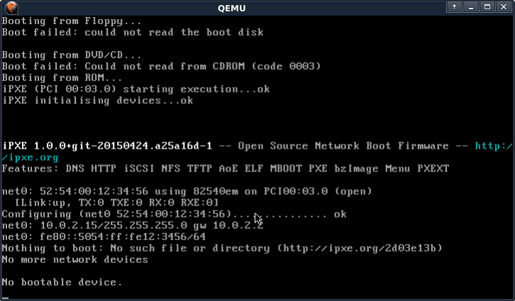
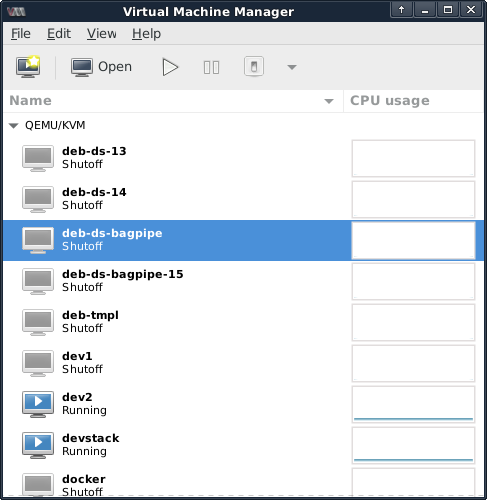
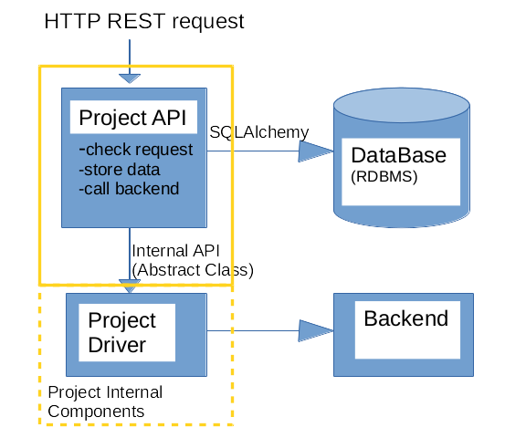
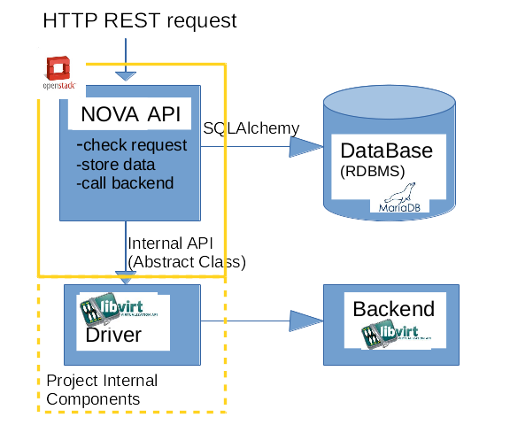
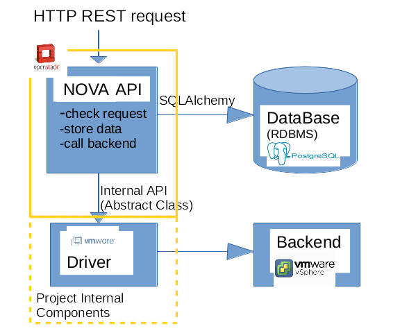

class: center, middle

# Cours Openstack 2016

---
#Présentation
Mathieu Rohon

OrangeLabs

Contributeur Openstack depuis 2012

Principale actvité : Openstack/Neutron

---
# Scope du cours

- Virtualisation
- Cloud Computing/IaaS
- Datacenter Virtuel
- __Opensource__
- __Openstack__

---
name: agenda
# Agenda

1. [Virtualisation](#virtualisation)
1. [Openstack](#openstack)
1. Keystone
1. Glance
1. Nova
1. Neutron
1. Cinder
1. Swift
1. Heat
1. CI/CD Openstack

---
name: virtualisation
#La machine virtuelle (VM)

- Un système d'exploitation (OS) tournant comme un simple logiciel;
- l'OS n'a pas conscience d'être virtualisé par un autre OS;
- on parlera de __GUEST__ ou de __VM__ pour l'OS virtuel, et de __HYPREVISEUR__ ou de __HOST__ pour le système sous-jacent;
- la comminication inter-VM se fait __exclusivement par le réseau__, même si les VMs sont sur le même HOST;
- les VMs sont __isolées du host__ et n'ont donc pas accès au matériel;
- nécéssite d'émuler le matériel (CPU/RAM/IO/GPU)

<p style="text-align:center;"></p>

---
#L'hyperviseur
L'hyperviseur a pour rôle de gérer les VMs et d'émuler les accès des VMs au matériel.

Historiquement, il existe 2 types d'hyperviseurs : 
- type 1 : l'hyperviseur est à la place de l'OS (VMWare ESXi, XEN)
- type 2 : l'hyperviseur tourne comme un logiciel sur un OS existant (VirtualBox, QEMU)

<p style="text-align:center;"></p>

- type hybride : l'hyperviseur tourne dans le noyau (module linux) de l'OS existant (kvm)
---
#L'émulation

La solution basique pour créer une VM consiste donc à émuler son matériel :

- Solution opensource : __Qemu__
- Avantage :
    - Permet de faire tourner du matériel différent dans la VM de celui présent sur le HOST (ex CPU ARM sur x86)
- Inconvénient :
    - __très couteuse en CPU__
    - toutes les instructions CPU doivent êter réinterpretées

---
#L'émulation iso-matériel


Mais dans le CLoud Computing ce qui va nous intéresse c'est d'isoler les VMs, et non d'émuler du matériel.


Si ma VM connait le matériel du HOST, je n'ai plus les problèmes de performance?

---
#L'émulation iso-matériel

Malheureusement __non__ :
- l'OS du HOST cherche a executer des instructions privilégiées sur le CPU (protected mode, Ring 0), mais n'y est pas authorisé en tant que logiciel (Ring 3)

<p style="text-align:center;"></p>
- Pas d'accès direct au matériel donc :
    - Pas d'accès performant à la RAM (chipset MMU): nécéssite l'émulation de ce chipset par le HOST
    - Pas d'accès performant (DMA) aux équipements d'entée/sortie (disque, carte réseau...)

---
#L'émulation iso-matériel aidée

La paravirtualisation (Xen):
- les Guests sont au courant qu'ils sont virtualisés;
- au lieu d'appeler les instructions couteuses à émuler, ils vont demander à l'Hyperviseur de les executer à leur place;
- VirtualBox guest additions?


<p style="text-align:center;"></p>

---
#L'émulation iso-matériel aidée
Les améliorations matérielles :
- Intel VT-x / AMD-V / VIA VT : authoriser les VMs à exécuter les instructions privilégiées;
- Intel EPT / AMD RVI : authorise les VMs à acceder directement à la MMU;
- Intel VT-d / AMD-Vi : permet l'accès des VMs au DMA et redirige les intérruptions : on peut assigner un périphérique PCI à une VM;
- SRIOV : carte PCI-Express pouvant être divisée; chaque partie peut alors être affectée à un VMs;

Ces améliorations matérielles sont nativement intégrées dans les équipements récents (à activer dans le BIOS) et les hyperviseurs savent en tirer partie, ce qui rend la virtualisation __beaucoup moins couteuse en CPU__

---
#Virtualisation
##Créer ses VMs
On peut directement le faire avec kvm :
```basch
#qemu-img create -f qcow2 /tmp/img.qcow2 6G
Formatting '/tmp/img.qcow2', fmt=qcow2 size=6442450944 encryption=off cluster_size=65536 lazy_refcounts=off refcount_bits=16
#kvm -m 256 /tmp/img.qcow2
```

--
count: false

<p style="text-align:center;"></p>

```basch
#ps -aux | grep kvm
mat      17815  1.7  0.2 706368 48772 pts/5    Sl+  15:23   0:17 qemu-system-x86_64 -enable-kvm -m 256 /tmp/img.qcow2
```

---
#Virtualisation
##Libvirt
Plusieurs technologies de virtualisation existent (KVM, Xen, VirtualBox, LXC...).

Il est donc nécéssaire de créer une API pour abstraire ces technologies pour des applications de managment de VM. c'est le but du projet [libvirt](https://libvirt.org/html/index.html)

Libvirt permet de gérer ces VM et leur ecosystème (reseau, storage) en fournissant un API, exposable sur le réseau.

Openstack ou d'autres outils de managment de VM peuvent alors utiliser cette API.

---
#Virtualisation
##Gestion des VMs
Grace a des logiciels dédiés (virt-manager/libvirt, Virtual-box, VMWare Player...) la gestion de ces VMs est simplifiée.

On peut rapidement créer une VM pour tester une nouvelle application sans compromettre l'hote. C'est très utile dans plusieurs cas :
- faire tourner des services linux sous Windows/Mac;
- installer des logiciels suspects;
- tester des applications sans compromettre son environnement;

--
count: false

<p style="text-align:center;"></p>

---
#Virtualisation
##Gestion des VMs
Souvent, des TP d'applicatifs sont menés à partir de VM préconfigurées, incluant l'application installée sur la VM.

Ainsi on évite toute la partie configuration de l'application (plus pour l'admin) pour se concentrer sur son utilisation, toute en ayant une application par étudiant.

Pour cela l'outil plébiscité semble être Vagrant.
Chaque étudiant se verra remettre :
- un fichier descriptif de la (des) VM;
- un fichier servant de disque pour la (les) VM;

Vagrant utilisera alors VirtualBox (ou Libvirt via plugin dedié) pour booter ses VMs telles qu'elles ont été définies dans le fichier descriptif.

---
#Virtualisation
##Gestion des VMs
D'autres logiciels sont orientés vers la gestion de parc et d'hote de VMs : Proxmox, OVirt(libvirt).

Ils permettent de rationnaliser davantage la gestion du parc de VMs en les placant de manière optimisée en fonction de leur contraintes.

Quelques pratiques communes pour l'optimisation de l'utilisation des resources du DC :

- over-subscrition : le nombre de vCPU du total des VMs placée sur l'hyperviseur est supérieur au nombre de CPUs de l'hyperviseur;
- ballooning : autoriser les VMs a dépasser la mémoire allouée pendant un bref instant;
- copy-on-write sur les disques (ex QCOW2);

Si le nombre de resources vient a manquer, on peut toujours ajouter un serveur physique au cluster, et migrer à chaud (live-migrate) les VMs qui en ont besoin. De même, les nouvelles VMs seront programmées (schedulées) sur ce nouveau serveur.

Les resources physiques ne sont donc plus dédiées à un projet mais mutualisées pour plusieurs projets dans des DataCenter (DC) distants. C'est l'émergence du __Cloud Computing__

---
name: virtualisation
#Virtualisation
##Rationnaliser l'IT
Pour assurer son bon fonctionnement, chaque application doit maitriser son environnement d'exécution (OS/Librairies).

Sans virtualisation chaque application nécéssite son serveur dédié.

- demander au service IT l'achat d'un serveur dédié;
- demander au service Réseau un port/VLan dédié;
- environnement contraint, peu flexible;
- on finit souvent par avoir un serveur surdimensionné (CPU/RAM/Disk) :

    - volontairement : pour ne pas avoir à le modifier en cas de forte charge de l'application;

    - involontairement : on utilise le matériel sourcé par le département IT, qui ne correspond pas forcément à mon besoin (trop de CPU/RAM/Disk)

Les datacenter deviennent alors une collection de serveurs sous-exploités!!

---
#Virtualisation
##Rationnaliser l'IT
Au lieu d'avoir un serveur physique par application, on va virtualiser les resources d'un serveur pour mutualiser les coûts, mais en gardant la segmentation logicielle.

On obtient ainsi des VMs:
- n'ayant accès qu'a une partie des resources (2 cpu sur 16, 2 Go de RAM /16Go, un disk de 20Go sur les 500Go dispo...)
- mais ayant une son propre environnement d'exécution (OS/Librairies)

La virtualisation a donc rapidement été adoptée dans les département IT des entreprises pour son __optimisation__ des resources et pour sa __flexibilité__.

---
#Virtualisation
##du cadeau de noel au public Cloud

Ces techniques de virtualistion sont utilisées depuis longtemps chez les gros hébergeurs (GAFA), pour leur propre besoins interne.

la légende :
```
Amazon, dont le parc était sudimenssionné pour pouvoir répondre au pic
d'audience de noel, se retrouvait avec des datacenter sous exploités
tout le reste de l'année.
Ils ont donc créé une offre publique de location de ses resources :
c'est la naissance d'amazon EC2
```
D'autres Cloud provider proposent des services accessibles à la demande, comme du storage et des software. Elles rencontrent un grand succes et on parle alors de \*aaS.

---
#Virtualisation / \*aaS
##Concept \*_as_a_Service
* Service en ligne (__Cloud__);
* Privilégie la facturation à l'usage;
* Accessible via des APIs;


--
count: false

Différents types de \*aaS :
* Storage (__STaaS__) : Google Drive, Amazon S3, Dropbox

--
count: false

* Infra (__IaaS__) : Google Compute, Amazon EC2, Azure, Cloudwatt

--
count: false

* Platform (__PaaS__) : Heroku, Scalingo, Docker

--
count: false

* Software (__SaaS__) : Google Doc, Office 365, Photoshop


--
count: false
Différents modèles de facturation :
* Quantité de stockage, de cpu, de mémoire, de bande passante, d'utilisateurs
* Par minute, semaine, mois, an.

---
#Virtualisation / IaaS
##La NASA
Des son côté, la NASA utilise un clone d'EC2 pour son cloud privé, géré par Eucalyptus. Mais sans grande satisfaction, car trop fermé et pas assez modulaire.

Beaucoup de déploiement de cloud IaaS s'oriente vers VMWare qui monopolise le marché.
Un alternative Opensource est plus que nécéssaire pour concurrencer VMWare.

La Nasa lance donc un nouveau cloud manager opensource, plus flexible, appélé Nova. Rackspace, un gros acteur de l'hébergement aux USA se joint à l'éffort pour creer Openstack.
Très vite, il est décidé d'héberger le projet dans une fondation, afin d'en assurer l'indépendance, et de fédérer le plus d'entreprise.

La fondation Openstack est alors créee et l'engouement est rapide.

Une autre initiative Opensource voit également le jour : Cloudstack. Menée par Citrix, qui détiens également Xen, Cloudstack est actuellement hébergé par la fondation Apache.

---
name: openstack
#Openstack
##Introduction
But :
- service de IaaS : découper un datacenter physique en datacenters virtuels, allouables à la demande, accessible par des API REST;
- devenir la plateforme de Cloud Computing de référence;
- pour les grand déploiments (CERN, Nectar...);
- pour le cloud privé et public;
- Interopérabilité des APIs;

(schéma montrant la migration d'un cloud à l'autre)

---
#Openstack
##Fondation
- [4 open](https://wiki.openstack.org/wiki/Open) :
    - Open Source : no Open Core; no entreprise edition.
    - Open Design : Design Summit tous les 6 mois;
    - Open Development : public code reviews, public roadmaps;
    - Open Community : meritocracy, élections des Leader par les developpeurs;
- faire vivre la communaté; (communication)
- s'assurer de l'intéropérabilité des API;
- s'assurer de la qualité du code;
- proteger la marque Openstack;

---
#Openstack
##Management
- Membres individuels : tous les developpeurs et autres...
- [Entreprises](http://www.openstack.org/foundation/companies/)
    - Platinium, Gold, Corporate
- Board of directors : 
    - gère la fondation (budget, marque, etc...)
    - Platinium Directors (1 par membre platinium)
    - Gold Directors élus par les membres Gold
    - Individual Directors élus par les membres individuels
- Technical committee
    - membres élus par les développeurs
    - gère la cohérence technique d'Openstack 
- User committee
    - membres individuels élus
    - representent les utilisateurs

source : [openstack.org](http://www.openstack.org/legal/bylaws-of-the-openstack-foundation/)

---
#Openstack
##En chiffre
Openstack en chiffres : 
- +5000 contributeurs;
- ~300 company ont proposés des commits;
- ~1600 commit par mois;
source : [stackalitics.com](www.stackalitics.com)
source : [activity.openstack.org](http://activity.openstack.org/dash/browser/)

---
#Openstack
##Le code
- développé en python (2.7 + compatibilité python 3);
- avec des regles de codage fortes (pep8)
    - pour une meilleur maintenabilité;
    - pour une facilité d'adoption pour les newcomers;
- avec un grande couverture de tests unitaires et fonctionnels;
- sous licence Apache 2.0
    - modifiable et redistribuable;


---
#Openstack
##Historique

(schéma...)

---
#Openstack
##Communauté
- Summit : 2 fois par an (+Midcycle)
- Mailing List : openstack; openstack-dev; openstack-operator....
- IRC : un chan par projet;
- réunion hebdo par projet et par sous-projet;
- ask.openstack.org;
---
#Openstack
##Mutliples composants

Chaque composant va fournir :
- un projet (dev/roadmap/git..) dédié (launchpad/git/gerrit);
- des resources as a service(compute, storage, networks...);
- une [API REST] (https://en.wikipedia.org/wiki/Representational_state_transfer) (souvent calquée et compatible EC2);
- une base de données dédiée;
- une architecture modulaire;
- une implémentation opensource de référence :
    - dans l'ADN d'openstack;
    - nécécaire pour les tests fonctionnels automatisés;
---
#Openstack
##Architecture d'un composant
<p style="text-align:center;"></p>

---
#Openstack
##Architecture nova/libvirt/kvm/mariadb :
<p style="text-align:center;"></p>

---
#Openstack
##Architecture nova/VMWare/postgre :
<p style="text-align:center;"></p>


---
#Openstack
##Mutliples composants
Les composants de base : 
- Keystone : gestion d'identité, et catalogue de service;
- Glance : gestion des images utilisées pour lancer une VM;
- Nova : gestion des VM;

Les composants additionnels : 
- Cinder : gestion des volume (disque dur, mode block) attaché à chaque VM:
- Neutron : gestion du réseaux et des ports de VMs;
- Horizon : interface graphique;
- Heat : Orchestartion de VM;
- Swift : gestion de stockage (mode fichier)

et [bien d'autres](http://governance.openstack.org/reference/projects/index.html)...

---
#Openstack
##Mutliples composants

Historiquement les projet openstack se divisant entre : 
- integrated
- incubated
- stackforge

Il devenait trop difficile de déterminer quels projets devaient être "integrated", alors Openstack est passé en mode BigTent :

- Tous projets relatifs à Openstack et respectant les 4 open peuvent devenir un projet openstack officiel;
- La notion de DefCore persiste : éléments indispensable d'un cloud Openstack (nova, glance, keystone...);

---
#Openstack
##Architecture Simplifiée

<p style="text-align:center;"></p>
---
#Openstack
##Architecture Operationnelle

<p style="text-align:center;"></p>

---
#Openstack
##Keystone

Keystone est l'une des brique de base d'openstack, et est indispensable à son fonctionnement;

Keystone est accessible par API : 
- API admin : port 35357;
- API user : port 5000;

Keystone gère : 
- la liste des utilisateurs;
- la liste des tenants/projets;
- la liste des roles;
- la correspondance entre les rôles<->utilisateurs<->tenants
- l'authentification des utilisateurs par attribution de token;
- le catalogue des service Openstack;


---
#Openstack
##Keystone 

La notion de __tenant__ (aussi appelé __projet__), __user__, __role__ :
- un tenant ou projet, est une organisation à laquelle sont allouées des resources physiques du cloud (CPU/RAM/Disk...);
- chaque utilisateur appartient à un tenant;
- pour s'identifier sur un cloud openstack, un user utilisera le couple user/tenant;
- un utilisateur peut appartenir à plusieurs tenant;
- lorsqu'un utilisateur créé une resource (ex. une VM), il la créé pour le compte d'un tenant;
- chaque utilisateur à un rôle dans chacun de ses tenants (admin/member...);

---
#Openstack
##Keystone 

```basch
$ openstack project list
+----------------------------------+--------------------+
| ID                               | Name               |
+----------------------------------+--------------------+
| 1484c557018b49a4acd6e4e331e3bc55 | service            |
| 3ae93431f89941bea16f92346471be11 | alt_demo           |
| 80d01fa581d041d9bfa1770a5ae09ad9 | admin              |
| cbf2d14974b64205824d121f5b38c525 | invisible_to_admin |
| de060cd2e96e4b1abdeb34b4cf1a121e | demo               |
+----------------------------------+--------------------+

$ openstack user list
+----------------------------------+----------+
| ID                               | Name     |
+----------------------------------+----------+
| c14f4133ab044f4ca002e795904383d3 | admin    |
| 48aa640562d14ffab7bdee26a90bd484 | demo     |
| 434109ca12b54477945f490fbc2ee4e3 | alt_demo |
| 3c4ebde0229e4f89af27a8d78ebf57c2 | nova     |
| aab6960638964c27a5500e644fafda01 | glance   |
| 08e6e73d9d3942df99ae8d290027652f | cinder   |
+----------------------------------+----------+
```
---
#Openstack
##Keystone 
```basch
$ openstack role list
+----------------------------------+---------------+
| ID                               | Name          |
+----------------------------------+---------------+
| 76816e40d9d44200b85b98a9326fcb61 | admin         |
| 9961fe4db10846319f91054071926269 | Member        |
| d11de740d31b4e27aa1b1db81cac268c | service       |
+----------------------------------+---------------+
```
---
#Openstack
##Keystone 

le user "admin" à le role "admin" dans le projet "demo" et dans le projet "alt-demo"

```basch
$ openstack role list --user admin --project demo
+----------------------------------+-------+---------+-------+
| ID                               | Name  | Project | User  |
+----------------------------------+-------+---------+-------+
| 76816e40d9d44200b85b98a9326fcb61 | admin | demo    | admin |
+----------------------------------+-------+---------+-------+
$ openstack role list --user admin --project alt_demo
+----------------------------------+-------+----------+-------+
| ID                               | Name  | Project  | User  |
+----------------------------------+-------+----------+-------+
| 76816e40d9d44200b85b98a9326fcb61 | admin | alt_demo | admin |
+----------------------------------+-------+----------+-------+
```
---
#Openstack
##Keystone
tandis que le user demo a le role member dans le projet demo
```basch
$ openstack role list --user demo --project demo
+----------------------------------+-------------+---------+------+
| ID                               | Name        | Project | User |
+----------------------------------+-------------+---------+------+
| 9961fe4db10846319f91054071926269 | Member      | demo    | demo |
+----------------------------------+-------------+---------+------+
```
---
#Openstack
##Keystone

la notion d'endpoint :
- chaque service Openstack est enregistré dans keystone;
- il enregistre son type;
- il enregistre son URL;
```basch
$ openstack endpoint list
+----------------------------------+-----------+--------------+----------------+
| ID                               | Region    | Service Name | Service Type   |
+----------------------------------+-----------+--------------+----------------+
| bdb373a7c92546a08fcae97d5e64280d | RegionOne | glance       | image          |
| b057b3c9c007439cbe588c77e4b802d6 | RegionOne | cinderv2     | volumev2       |
| bc3a4293d2df41149936726049a99c2d | RegionOne | nova         | compute        |
| e00562c57f0b46f2a504adebe3276d0f | RegionOne | keystone     | identity       |
| 8db911c7eed2460c9250186176a6fc5b | RegionOne | nova_legacy  | compute_legacy |
| 13d006f2a5b74e24bbee04b38c2f9bc5 | RegionOne | cinder       | volume         |
+----------------------------------+-----------+--------------+----------------+
```
---
#Openstack
##Keystone
```basch
$ openstack endpoint show keystone
+--------------+-----------------------------------+
| Field        | Value                             |
+--------------+-----------------------------------+
| adminurl     | http://192.168.122.237:35357/v2.0 |
| enabled      | True                              |
| id           | e00562c57f0b46f2a504adebe3276d0f  |
| internalurl  | http://192.168.122.237:5000/v2.0  |
| publicurl    | http://192.168.122.237:5000/v2.0  |
| region       | RegionOne                         |
| service_id   | 208c0d3e39f943ba8f5be8425daafb3c  |
| service_name | keystone                          |
| service_type | identity                          |
+--------------+-----------------------------------+
```
---
#Openstack
##Keystone
La notion de token : 
- avant d'utiliser un endpoint, l'utilisateur s'authentifie via keystone et son username/password/tenant;
- keystone lui renvoie un token;
- l'utilisateur emploiera ce token pour s'authentifier sur les endpoints;
- chaque endpoint vérifiera la validité de ce token auprès de keystone avant de traiter la requete;
- keystone donnera également le rôle de l'utilisateur au endpoint;
- ainsi l'endpoint pourra vérifier si l'utilisateur : 
    - à le droit de demander la requete (role);
    - à le quota nécéssaire pour créer la resource;

---
#Openstack
##Keystone
```basch
$ openstack token issue --os-username admin --os-project-name admin --os-auth-url http://localhost:5000/v2.0 
Password: 
+------------+----------------------------------+
| Field      | Value                            |
+------------+----------------------------------+
| expires    | 2016-04-01T15:41:53Z             |
| id         | aa521d73f8654911a181b964b01892f4 |
| project_id | 80d01fa581d041d9bfa1770a5ae09ad9 |
| user_id    | c14f4133ab044f4ca002e795904383d3 |
+------------+----------------------------------+
```
Je peux utiliser le token aa521d73f8654911a181b964b01892f4 pour faire des requetes sur les endpoint.

---
#Openstack
##Keystone - résumé

<p style="text-align:center;"></p>

---
#Openstack
##Glance

---
#Openstack
##Cinder

---
#Openstack
##Nova

---
#Openstack
##Neutron

---
#Openstack
##Heat

---
#Openstack
##Swift

---
#Openstack
##Horizon

---
#Openstack
##Heat


