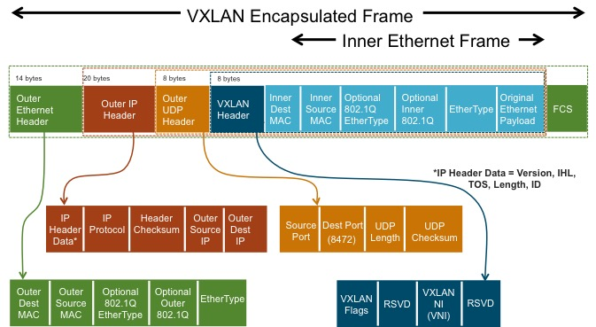

class: center, middle

# Cours Openstack 2016

---
#Présentation
Mathieu Rohon

Orange Labs

Contributeur Openstack depuis 2012

Principale actvité : Openstack/Neutron

Sources :
-  https://github.com/Osones/OpenStack-Formations/
-  https://github.com/arnaudmorin/OpenStack-Formations/
-  http://docs.openstack.org

Licences Creative Commons BY-SA 4.0


---
# Objectif du cours

- Comprendre ce qu'on entend pas __Cloud Computing__
- Connaitre les technologies de __Virtualisation__ utilisées dans le Cloud Computing
- Apprendre à gérer son Datacenter Virtuel __Openstack__

---
name: agenda
# Agenda

1. [Cloud Computing](#cloud)
    1. Avant le cloud
    1. Definition
    1. *aaS
1. [Virtualisation](#virtualisation)
    1. La machine virtuelle et l'hyperviseur
    1. L'émulation
    1. La paravirtualisation
    1. Les containers
    1. Créer/Gérer ses VMs
1. [Openstack](#openstack)
    1. Introduction
    1. [Keystone](#keystone)
    1. [Glance](#glance)
    1. [Nova](#nova)
    1. [Cinder](#cinder)
    1. [Neutron](#neutron)
    1. [Telemetry](#telemetry)
    1. [Heat](#heat)
    1. Swift
    1. CI/CD Openstack

---
template: agenda

###.right[Cloud Computing]

---
name: cloud
#Cloud computing
##Avant le Cloud computing

Pour comprendre l'attrait du cloud computing, étudions les étapes nécéssaires pour mettre en production une application __sans cloud computing__

---
#Cloud computing
##Avant le Cloud computing


Pour assurer son bon fonctionnement, une application doit maitriser son environnement :
- resources physiques (CPU/RAM);
- stockage (disque, backup);
- OS/Librairies/Soft sur chaque serveur;
- accès réseau (IP Publique, firewall, load balancer);

Chaque application nécéssitera donc un environnement dédié.

---
#Cloud computing
##Avant le Cloud computing

Pour les petites entreprises sans service IT, le développeur d'application doit se transformer en admin système/réseau/stockage pour déployer son environnement.

Dans de plus grosses entreprises, le développeur d'application passera par les étapes suivantes :

- demander au service IT l'achat d'un serveur dédié;
- demander au service Réseau un port/VLan dédié, et le réglage des firewall/load balancer...
- demander au service Stockage un environnement backuper pour stocker ses données;

---
#Cloud computing
##Avant le Cloud computing

Ces étapes sont souvent longues, donc peu flexibles : difficile de redimensionner rapidement son environnement en cas de pic ou de baisse d'activité de l'application;

On finit souvent par avoir un environnement surdimensionné (CPU/RAM/Disk) :
- volontairement : pour ne pas avoir à le modifier en cas de forte charge de l'application;
- involontairement : on utilise le matériel sourcé par le département IT/Réseau/Stockage, qui ne correspond pas forcément au besoin (trop de CPU/RAM/Disk)

Les datacenter deviennent alors une collection de __serveurs sous-exploités__ et donc __couteux__!!

---
#Cloud computing

Grâce au cloud computing, on va __flexibiliser__ l'accès aux resources, et __optimiser__ leur utilisation;

[Definition Wikipedia](https://en.wikipedia.org/wiki/Cloud_computing) :
- On demand : 
    - instanciation des resources très rapide;
    - facturation uniquement le temps nécéssaire;
- Shared processing resources and data : mutualisation des infrastructures pour optimiser les couts;

Au lieu d'avoir une infrastructure physique par projet, chaque projet va louer son infrastructure chez un prestataire tiers (interne ou externe à l'entreprise) :
- pas de compétences nécéssaires d'administration de l'infrastructure dans le projet;
- prévision des couts "pay as you go";
- adaptation rapide en cas de pic/baisse d'activité du projet;

---
#Cloud computing

On parlera de différents types de Cloud :
- public : l'infrastructure et les données sont hébergées par un opérateur tiers :
    - Amazon, Azure, Google...;
- privée : le cloud est géré en interne, souvent par un service dédié;
- hybride : le cloud privé loue des resources supplémentaire à un cloud public pour :
   - un pic de charge;
   - une opération temporaire;
   - des tests...

---
#Cloud computing
##Concept \*_as_a_Service
Dans le monde du cloud computing, on entend souvent parler du concept * As A Service. on peut le résumer par un service :
* en ligne (__Cloud__);
* qui privilégie la facturation à l'usage;
* accessible via des APIs;

---
#Cloud computing
##Concept \*_as_a_Service

Différents types de \*aaS :
--
count: false

* Storage (__STaaS__) : Offrir du stockage en ligne;
    - solution pour un déploiement interne : __Openstack__ Swift, Ceph, NetApp, EMC...
    - offres commerciales en ligne : Google Drive, Amazon S3, Dropbox

--
count: false

* Infra (__IaaS__) : Offrir de la Ram, du CPU et des I/O pour des datacenter virtuels;
    - solution pour un déploiement interne : __Openstack__ Nova, Cloudstack, VMWare...
    - offres commerciales en ligne : Google Compute, Amazon EC2, Azure, Cloudwatt

--
count: false

* Platform (__PaaS__) : Offrir un espace de stockage pour des applications server;
    - solution pour un déploiement interne : Cloud foundry, Docker, Tomcat (server J2EE)
    - offres commerciales : Heroku, Scalingo

---
#Cloud computing
##Concept \*_as_a_Service

* Software (__SaaS__) : Offrir une éxecution d'application personnalisée en ligne;
    - solution pour un déploiement interne : Etherpad, Editeur logiciel fournissant une offre __en ligne__
    - offres commerciales : Google Doc, Office 365, Photoshop


--
count: false
Et bien d'autres 
- Networkaas;
- VPNaas;
- DBaas;
- ...;

---
#Cloud computing
##Concept \*_as_a_Service

<p style="text-align:center;"></p>

---
#Cloud computing
##Flexibiliser l'IT

Dans le domaine du cloud, la flexibilité est primordiale.

Si on s'appuie sur des éléments physiques, il est très difficile d'obtenir la flexibilité.
Mettre a disposition un serveur physique nécéssite des étapes manuelles.

Côté réseau et stockage, des technologies de virtualisation existent et peuvent assez facilement être pilotée via des API en mode aaS :

- Réseau virtuel : segmentation logiciel
- Stockage virtuel : NFS, cifs (file), LVM (block)

Grâce aux nouvelles technologies de virtualisation d'OS, on va pouvoir créer des serveurs virtuels, beaucoup plus simples à piloter via des API en mode aaS;

---
template: agenda

###.right[Virtualisation]

---
name: virtualisation
#Virtualisation
##La machine virtuelle (VM)

- Un système d'exploitation (OS) tournant comme un simple logiciel;
- l'OS n'a pas conscience d'être virtualisé par un autre OS;
- on parlera de __GUEST__ ou de __VM__ pour l'OS virtuel, et de __HYPREVISEUR__ ou de __HOST__ pour le système sous-jacent;
- la comminication inter-VM se fait __exclusivement par le réseau__, même si les VMs sont sur le même HOST;
- les VMs sont __isolées du host__ et n'ont donc pas accès au matériel;
- nécéssite d'émuler le matériel (CPU/RAM/IO/GPU)

<p style="text-align:center;"></p>

---
#Virtualisation
##L'hyperviseur
L'hyperviseur a pour rôle de gérer les VMs et d'émuler les accès des VMs au matériel.

Historiquement, il existe 2 types d'hyperviseurs : 
- type 1 : l'hyperviseur est à la place de l'OS (VMWare ESXi, XEN)
- type 2 : l'hyperviseur tourne comme un logiciel sur un OS existant (VirtualBox, QEMU)

<p style="text-align:center;"></p>

- type hybride : l'hyperviseur tourne dans le noyau (module linux) de l'OS existant (kvm)
---
#Virtualisation
##L'émulation

La solution basique pour créer une VM consiste donc à émuler son matériel :

- Solution opensource : __Qemu__
- Avantage :
    - Permet de faire tourner du matériel différent dans la VM de celui présent sur le HOST (ex CPU ARM sur x86)
- Inconvénient :
    - __très couteuse en CPU__
    - toutes les instructions CPU doivent êter réinterpretées

---
#Virtualisation
##L'émulation iso-matériel


Mais dans le CLoud Computing ce qui va nous intéresse c'est d'isoler les VMs, et non d'émuler du matériel.

Si ma VM connait le CPU du HOST, je n'ai plus les problèmes de performance?

---
#Virtualisation
##L'émulation iso-matériel

Malheureusement __non__ :
- l'OS du GUEST cherche a executer des instructions privilégiées sur le CPU (protected mode, Ring 0), mais n'y est pas authorisé en tant que logiciel (Ring 3)

<p style="text-align:center;"></p>
- Pas d'accès direct au matériel donc :
    - Pas d'accès performant à la RAM (chipset MMU): nécéssite l'émulation de ce chipset par le HOST
    - Pas d'accès performant (DMA) aux équipements d'entée/sortie (disque, carte réseau...)

---
#Virtualisation
##L'émulation iso-matériel aidée
Les améliorations matérielles :
- Intel VT-x / AMD-V / VIA VT : authoriser les VMs à exécuter les instructions privilégiées;
- Intel EPT / AMD RVI : authorise les VMs à acceder directement à la MMU;
- Intel VT-d / AMD-Vi : permet l'accès des VMs au DMA et redirige les intérruptions : on peut assigner un périphérique PCI à une VM;
- SRIOV : carte PCI-Express pouvant être divisée; chaque partie peut alors être affectée à un VMs;

Ces améliorations matérielles sont nativement intégrées dans les équipements récents (à activer dans le BIOS) et les hyperviseurs savent en tirer partie, ce qui rend la virtualisation __beaucoup moins couteuse en CPU__

---
#Virtualisation
##La paravirtualisation

La paravirtualisation (Xen):
- les Guests sont au courant qu'ils sont virtualisés;
- au lieu d'appeler les instructions couteuses à émuler, ils vont demander à l'Hyperviseur de les executer à leur place;

<p style="text-align:center;"></p>

- Avantage : permet de se passer des amélioration matérielles (VT etc..) en étant performant -> succes de __Xen__ au début de la virtualisation;
- Inconvénient : il faut modifier le kernel du guest;

Cette technologie est toujours très utilisée notamment pour les driver d'I/O linux avec virtio;

---
#Virtualisation
##Les containers

Pour éviter l'éumlation couteuse, on peut également partager le noyau, et donc l'accès au matériel.
<p style="text-align:center;"></p>

C'est l'angle pris par les __container LXC__; chaque application s'exécute dans un environnement contraint par :
- les cgroup : controle l'allocation des resources;
- les namespaces : controle l'isolation des containers/applications;

Ces deux technologies sont également au coeur des technologies __docker__;

---
#Virtualisation
##Les containers

Avantages :
- très performants : pas d'émulation;
- boot très rapide;
- nécéssite moins de resources : la ram non utilisée réellement est disponible;

Inconvénients :
- ne marche que pour des environnements linux;
- le partage du kernel isole beaucoup moins;
- problème de sécurité;

---
#Virtualisation
##Résumé

Dans le monde IaaS, on utilisera des VMs permettant de créer des datacenter virtuels;

On s'appuie désormais sur des hyperviseurs optimisés, tirant partie des avancées matérielles rendant un ratio isolation/performance adéquat :
- QEMU/KVM;
- XEN;
- VMWare ESX;

Les containers sont envisagés dans des environnements plus permissifs; on voit de plus en plus de containers dans des VMs (Openstack Magnum)!

---
#Virtualisation
##Créer ses VMs
On peut directement le faire avec qemu/kvm.

Il faut d'abord s'assurer que notre processeur supporte la virtualisation :
```bash
*$ grep -e vmx -e ept /proc/cpuinfo
flags : ... ept ... vmx ...
```
Et que le module noyau kvm est chargé :
```bash
*$ lsmod | grep kvm
kvm_intel             167936  6
kvm                   528384  1 kvm_intel
```
---
#Virtualisation
##Créer ses VMs
On lance alors une VM en créant un disque pour notre OS :
```bash
*$ qemu-img create -f qcow2 /tmp/img.qcow2 6G
Formatting '/tmp/img.qcow2', fmt=qcow2 size=6442450944 encryption=off cluster_size=65536 lazy_refcounts=off refcount_bits=16
*$ qemu-system-x86_64 -enable-kvm /tmp/img.qcow2
```

--
count: false

<p style="text-align:center;"></p>

```bash
*$ ps -aux | grep kvm
mat      17815  1.7  0.2 706368 48772 pts/5    Sl+  15:23   0:17 qemu-system-x86_64 -enable-kvm /tmp/img.qcow2
```

Sans ça, il faudra se contenter d'émulation sans accélération : qemu;

---
#Virtualisation
##Créer ses VMs

Beaucoup d'options peuvent être passées en paramètre de qemu/kvm pour :
- attacher un cdrom/usb/netdev;
- gérér l'orde de boot;
- gérer l'environnement graphique;
- gérer le nombre de cpu/ram;
- ...

une commande qemu ressemble plus souvent à :
```sh
*$ ps -aux | grep qemu
libvirt+  6945  0.5  6.6 11990520 1086216 ?    Sl   Apr20   8:16 qemu-system-x86_64 -enable-kvm -name dev4 -S -machine pc-i440fx-2.5,accel=kvm,usb=off,vmport=off -cpu Haswell-noTSX -m 8000 -realtime mlock=off -smp 4,sockets=4,cores=1,threads=1 -uuid 47f8d918-4b81-4d64-b253-fd932de35d2d -no-user-config -nodefaults -chardev socket,id=charmonitor,path=/var/lib/libvirt/qemu/domain-dev4/monitor.sock,server,nowait \
-mon chardev=charmonitor,id=monitor,mode=control -rtc base=utc,driftfix=slew -global kvm-pit.lost_tick_policy=discard -no-hpet -no-shutdown -global PIIX4_PM.disable_s3=1 -global PIIX4_PM.disable_s4=1 -boot strict=on -device ich9-usb-ehci1,id=usb,bus=pci.0,addr=0x6.0x7 -device ich9-usb-uhci1,masterbus=usb.0,firstport=0,bus=pci.0,multifunction=on,addr=0x6 \
-device ich9-usb-uhci2,masterbus=usb.0,firstport=2,bus=pci.0,addr=0x6.0x1 -device ich9-usb-uhci3,masterbus=usb.0,firstport=4,bus=pci.0,addr=0x6.0x2 -device virtio-serial-pci,id=virtio-serial0,bus=pci.0,addr=0x5 -drive file=/data/vm/dev4.qcow2,format=qcow2,if=none,id=drive-virtio-disk0 -device virtio-blk-pci,scsi=off,bus=pci.0,addr=0x7,drive=drive-virtio-disk0,id=virtio-disk0,bootindex=1 -drive if=none,id=drive-ide0-0-0,readonly=on -device ide-cd,bus=ide.0,unit=0,drive=drive-ide0-0-0,id=ide0-0-0 -netdev tap,fd=26,id=hostnet0,vhost=on,vhostfd=28 \
-device virtio-net-pci,netdev=hostnet0,id=net0,mac=52:54:00:f1:e7:47,bus=pci.0,addr=0x3 -chardev pty,id=charserial0 -device isa-serial,chardev=charserial0,id=serial0 -chardev spicevmc,id=charchannel0,name=vdagent -device virtserialport,bus=virtio-serial0.0,nr=1,chardev=charchannel0,id=channel0,name=com.redhat.spice.0 -device usb-tablet,id=input0 i\
-spice port=5900,addr=127.0.0.1,disable-ticketing,image-compression=off,seamless-migration=on -device qxl-vga,id=video0,ram_size=67108864,vram_size=67108864,vgamem_mb=16,bus=pci.0,addr=0x2 -device intel-hda,id=sound0,bus=pci.0,addr=0x4 -device hda-duplex,id=sound0-codec0,bus=sound0.0,cad=0 -chardev spicevmc,id=charredir0,name=usbredir -device usb-redir,chardev=charredir0,id=redir0 -chardev spicevmc,id=charredir1,name=usbredir -device usb-redir,chardev=charredir1,id=redir1 -device virtio-balloon-pci,id=balloon0,bus=pci.0,addr=0x8 -msg timestamp=on
```

Il est donc utile d'avoir des outils pour gérer cette complexité

---
#Virtualisation
##Gestion des VMs

Pour que la VM soit réellement utilisable, il faut prendre en compte son environnement :
- réseau;
- stockage;
- image de base;
- paramètres du host;
- persistence de la VM;

Plusieurs logiciels permettent de gérer correctement les VMs : 
- virt-manager/libvirt
- Virtual-box
- VMWare Player

---
#Virtualisation
##Libvirt

Plusieurs hyperviseurs existent sur le marché. Il peut donc être utile d'avoir __une API__ commune pour abstraire les fonctions de ces hyperviseurs;

C'est le rôle de [Libvirt](https://libvirt.org/) dont l'API permet de  :
- gérer les VMs (domain dans le context libvirt)
- gérer l'environnement de la VM sur le HOST :
    - l'environnement réseau (NAT/Bridge, etc...)
    - l'environnement de stockage sur le host
    - ...

Libvirt supporte __plusieurs hyperviseurs__ (Qemu/KVM, Xen, LXC) et offre une __interface d'accès à distance__ à l'hyperviseur;

Deux outils peuvent notamment être utilisés pour piloter libvirt :
- virsh : interface libvirt en ligne de comande fournie avec libvirt;
- virt-manager : interface graphique;

---
#Virtualisation
##Libvirt

Démo Virt-manager/libvirt

<p style="text-align:center;"></p>

---
#Virtualisation
##Cas d'usage des VMs locales
On peut rapidement créer une VM pour tester une nouvelle application sans compromettre l'hote. C'est très utile dans plusieurs cas :
- faire tourner des services linux sous Windows/Mac;
- installer des __logiciels suspects__;
- __tester__ des applications sans compromettre son environnement;

Les vendeurs d'applications proposent souvent de tester leurs applicatif en proposant des VMs;

Pour cela ils fournissent :
- les disques des VMs nécéssaires;
- un fichier descriptif de l'environnement nécéssaire pour chaque VM (ram/cpu etc..);

Des outils et formant proposent de déployer des VMs à partir de ce genre de resources :
- __Vagrant__ Files (VirtualBox, voir libvirt avec plugin)
- OVA/OVF format pour VMWare
- XML files pour libvirt;

---
#Virtualisation
##Gestion de parc de VMs

D'autres logiciels sont orientés vers la gestion de parc et de HOSTs de VMs :
- Proxmox;
- OVirt( qui utilisent libvirt);
- VMWare VCenter;

Ils permettent de rationnaliser davantage les resources pour les VMs en les placant de manière optimisée en fonction de leur contraintes.

__On peut parler de Cloud Computing__ voir d'IaaS sur ces outils fournissent un API.

---
#Virtualisation
##Gestion de parc de VMs

Quelques pratiques communes pour l'optimisation de l'utilisation des resources du DC :

- over-subscrition : le nombre de vCPU du total des VMs placée sur l'hyperviseur est supérieur au nombre de CPUs de l'hyperviseur;
- ballooning : autoriser les VMs a dépasser la mémoire allouée pendant un bref instant;

Si le nombre de resources vient a manquer, on peut toujours ajouter un serveur physique au cluster de HOST, et migrer à chaud (live-migrate) les VMs.
De même, les nouvelles VMs seront programmées (schedulées) sur ce nouveau serveur.

---
#Virtualisation
##Gestion de parc de VMs

Quelques pratiques communes pour l'optimisation de l'utilisation des resources du DC :

- copy-on-write sur les disques (ex QCOW2) :

<p style="text-align:center;"></p>

```bash
*$ qemu-img create -b debian-8.3.0.BASE.qcow2 -f qcow2 apache.qcow2 10G
Formatting 'apache.qcow2', fmt=qcow2 size=10737418240 backing_file=debian-8.3.0.BASE.qcow2 encryption=off cluster_size=65536 lazy_refcounts=off refcount_bits=16
*$ ls -lha apache.qcow2
-rw-r--r-- 1 root root 193K Apr 21 16:09 apache.qcow2
```

---
#Virtualisation

La virtualisation nous permet donc :
- d'optimser les resources dans le Datacenter;
- tout en gardant :
    - de la performance;
    - de l'isolation et donc de la sécurité;

En ajoutant une couche d'API pour fournir ses resources __à la demande__ et un manager pour  __orchestrer__ leur allocation, on obtient un Cloud IaaS.

---
template: agenda
name: openstack
###.right[Openstack]

---
#Openstack
##L'émergence du cloud computing

A la fin des années 2010, Les services IT s'approprient l'utilisation du cloud computing pour optimiser leur resources.

VMWare est le produit le plus mature et remporte donc un grand succès!

De plus gros acteurs habitués des outils Opensource s'orientent vers des technologies plus ouvertes :
- Amazon -> Xen;
- La Nasa -> Eucalyptus (Open Core);

Ces techniques de virtualistion sont utilisées depuis longtemps chez les gros hébergeurs (GAFA), pour leur propre besoins interne.

---
#Openstack
##L'émergence du cloud computing public

la légende :
```
Amazon, dont le parc était sudimenssionné pour pouvoir répondre au pic
d'audience de noel, se retrouvait avec des datacenter sous exploités
tout le reste de l'année.
Ils ont donc créé une offre publique de location de ses resources :
c'est la naissance d'amazon EC2
```
D'autres Cloud provider proposent des services accessibles à la demande, comme du storage et des software. Ils rencontrent un grand succès.

---
#Openstack
##La NASA
De son côté, la NASA utilise un clone d'EC2 pour son cloud privé, géré par Eucalyptus. Mais sans grande satisfaction, car __trop fermé__ et pas assez modulaire.

Beaucoup de déploiements de cloud IaaS s'orientent vers VMWare VCenter qui monopolise le marché.

__Une alternative Opensource est plus que nécéssaire pour concurrencer VMWare et AWS EC2__.

La Nasa lance donc un nouveau cloud manager opensource, plus flexible, appélé __Nova__. __Rackspace__, un gros acteur de l'hébergement aux USA se joint à l'éffort pour créer Openstack.
Très vite, il est décidé d'héberger le projet dans une fondation, afin d'en assurer l'__indépendance__, et de __fédérer__ le plus d'entreprises possible.

La __fondation Openstack__ est alors créée et l'engouement est rapide.

Une autre initiative Opensource voit également le jour : __Cloudstack__. Menée par Citrix, qui détiens également Xen, Cloudstack est actuellement hébergé par la fondation Apache.

---
#Openstack
##Introduction
But :
- service de IaaS : découper un datacenter physique en datacenters virtuels, allouables à la demande, accessibles par des API REST;
- devenir la plateforme de Cloud Computing de référence permettant à des acteurs tiers de :
    - concurrencer Amazon pour le cloud public;
    - concurrencer VMWare pour le cloud privé;
- pour les grands déploiments (CERN, Nectar...);
- pour le cloud privé et public;
- Interopérabilité des APIs;

---
#Openstack
##L'utilité des API normées

Pour les utilisateurs de Clouds, Openstack permet de changer de provider de cloud, sans changer les outils :

<p style="text-align:center;"></p>

---
#Openstack
##Fondation
- [4 open](https://wiki.openstack.org/wiki/Open) :
    - Open Source : no Open Core; no entreprise edition.
    - Open Design : Design Summit tous les 6 mois;
    - Open Development : public code reviews, public roadmaps;
    - Open Community : meritocracy, élections des Leader par les developpeurs;
- faire vivre la communaté; (communication)
- s'assurer de l'intéropérabilité des API;
- s'assurer de la qualité du code;
- proteger la marque Openstack;

---
#Openstack
##Management
- Membres individuels : tous les developpeurs et autres...
- [Entreprises](http://www.openstack.org/foundation/companies/)
    - Platinium, Gold, Corporate
- Board of directors : 
    - gère la fondation (budget, marque, etc...)
    - Platinium Directors (1 par membre platinium)
    - Gold Directors élus par les membres Gold
    - Individual Directors élus par les membres individuels
- Technical committee
    - membres élus par les développeurs
    - gère la cohérence technique d'Openstack
- User committee
    - membres individuels élus
    - representent les utilisateurs

source : [openstack.org](http://www.openstack.org/legal/bylaws-of-the-openstack-foundation/)

---
#Openstack
##En chiffre
Openstack en chiffres : 
- +5000 contributeurs;
- ~300 company ont proposés des commits;
- ~1600 commit par mois;
source : [stackalitics.com](http://www.stackalitics.com)
source : [activity.openstack.org](http://activity.openstack.org/dash/browser/)

---
#Openstack
##Le code
- développé en python (2.7 + compatibilité python 3);
- avec des règles de codage fortes (pep8)
    - pour une meilleur maintenabilité;
    - pour une facilité d'adoption pour les newcomers;
- avec un grande couverture de tests unitaires et fonctionnels;
- le code doit être approuvé par de "core dev" pour merger;
- sous licence Apache 2.0
    - modifiable et redistribuable;

---
#Openstack
##Historique

<p style="text-align:center;"></p>

---
#Openstack
##Communauté
- Summit : 2 fois par an (+Midcycle)
- Mailing List : openstack; openstack-dev; openstack-operator....
- IRC : un chan par projet;
- réunion hebdo par projet et par sous-projet;
- ask.openstack.org;

---
#Openstack
##Mutliples composants

Chaque composant va fournir :
- un projet (dev/roadmap/git..) dédié (launchpad/git/gerrit);
- des resources as a service(compute, storage, networks...);
- une [API REST](https://en.wikipedia.org/wiki/Representational_state_transfer) (souvent calquée et compatible EC2);
- une base de données dédiée;
- une architecture modulaire;
- une implémentation opensource de référence :
    - dans l'ADN d'openstack;
    - nécécaire pour les tests fonctionnels automatisés;
---
#Openstack
##Architecture d'un composant
<p style="text-align:center;"></p>

---
#Openstack
##Architecture nova/libvirt/kvm/mariadb :
<p style="text-align:center;"></p>

---
#Openstack
##Architecture nova/VMWare/postgre :
<p style="text-align:center;"></p>

---
#Openstack
##Mutliples composants
- __WSGI__ : Chaque composant utilise le framework python Web Server Gateway Interface ([WSGI](http://wsgi.readthedocs.org/en/latest/)), configuré via la lib paste.deploy. Cette configuration est accessible via le fichier /etc/composant/*-paste.ini.
- __Oslo__ : Beaucoup de composants vont avoir le même genre de tache à effectuer (gestion du fichier de config, gestion des log etc....). Pour factoriser ce travail, un ensemble de librairie sont proposées dans le projet transverse Openstack oslo.
- __requirements__ : De même afin d'éviter des problème d'incompatibilité de dépendances entre les projets Openstack, un pojet transverse appelé "requirements" à été créé. Lorqu'un projet veut utiliser/modifier une dépendance envers une librairy, il le fera via ce projet.
- __Policy__ : Chaque composant peut gérér l'accès à ces API en fonction de l'utilisateur et de son rôle. Il le fait via son fichier /etc/composant/policy.json
- __Client__ :Enfin, chaque composant fournit un client CLI qui facilite l'utilisation de l'API REST via la ligne de commande.

---
#Openstack
##Mutliples composants
Les composants de base : 
- Keystone : gestion d'identité, et catalogue de service;
- Glance : gestion des images utilisées pour lancer une VM;
- Nova : gestion des VM;

Les composants additionnels : 
- Cinder : gestion des volume (disque dur, mode block) attaché à chaque VM:
- Neutron : gestion du réseaux et des ports de VMs;
- Horizon : interface graphique;
- Heat : Orchestartion de VM;
- Swift : gestion de stockage (mode fichier)

et [bien d'autres](http://governance.openstack.org/reference/projects/index.html)...

---
#Openstack
##Mutliples composants

Historiquement les projet openstack se divisant entre : 
- integrated
- incubated
- stackforge

Il devenait trop difficile de déterminer quels projets devaient être "integrated", alors Openstack est passé en mode BigTent :

- Tous projets relatifs à Openstack et respectant les 4 open peuvent devenir un projet openstack officiel;
- La notion de DefCore persiste : éléments indispensables d'un cloud Openstack (nova, glance, keystone...);

---
#Openstack
##Architecture simplifiée

<p style="text-align:center;"></p>
---
#Openstack
##Architecture operationnelle

<p style="text-align:center;"></p>

---
#Openstack
##Architecture physique classique

<p style="text-align:center;"></p>

- Cloud Controller node : composant central pour l'API, la DB, le server AMQP;
- Compute node : héberge les VMs;
- Network node (neutron) : heberge les services réseaux (server dhcp, router...);
---
#Openstack
##Demo
Dans cette première démo, nous allons créer une VM, et étudier les étapes et les composants indispensables au boot d'une VM dans Openstack. 

---
class: center
#Openstack
##Demo - Login


---
class: center
#Openstack
##Demo - Tableau de bord


---
class: center
#Openstack
##Demo - Creation d'une VM


---
class: center
#Openstack
##Demo - Creation d'une VM


---
class: center
#Openstack
##Demo - Creation d'une VM


---
class: center
#Openstack
##Demo - Creation d'une VM


---
class: center
#Openstack
##Demo - Creation d'une VM


---
#Openstack
##Demo

Dans cette simple démo, nous avons utilisés 3 composants indispensables pour booter une VM : 
- keystone : pour s'identifier;
- glance : pour choisir l'image de base;
- nova : pour créer la VM;

Nous avons également utilisé un composant facultatif : 
- horizon : le tableau de bord

---
#Openstack
##Demo

Toute cette démo aurait pu se passer d'horizon si on avait utilisé notre login/password conjointement aux clients en ligne de commande de :

- glance pour connaitre les images disponibles;
```sh
*$ glance --os-username demo --os-password labo --os-tenant-name demo --os-auth-url http://192.168.122.241:5000/ image-list
+--------------------------------------+---------------------------------+
| ID                                   | Name                            |
+--------------------------------------+---------------------------------+
| b6305617-0451-46d8-98fd-2fde8f1a9c98 | cirros-0.3.4-x86_64-uec         |
+--------------------------------------+---------------------------------+
```

---
#Openstack
##Demo
- nova pour lister les flavor;

```sh
*$ nova --os-username demo --os-password labo --os-tenant-name demo --os-auth-url http://192.168.122.241:5000/ flavor-list
+----+-----------+-----------+------+-----------+------+-------+-------------+-----------+
| ID | Name      | Memory_MB | Disk | Ephemeral | Swap | VCPUs | RXTX_Factor | Is_Public |
+----+-----------+-----------+------+-----------+------+-------+-------------+-----------+
| 1  | m1.tiny   | 512       | 1    | 0         |      | 1     | 1.0         | True      |
| 2  | m1.small  | 2048      | 20   | 0         |      | 1     | 1.0         | True      |
| 3  | m1.medium | 4096      | 40   | 0         |      | 2     | 1.0         | True      |
| 4  | m1.large  | 8192      | 80   | 0         |      | 4     | 1.0         | True      |
| 5  | m1.xlarge | 16384     | 160  | 0         |      | 8     | 1.0         | True      |
+----+-----------+-----------+------+-----------+------+-------+-------------+-----------+
``` 

---
#Openstack
##Demo
- nova pour booter la VM;
```sh
*$ nova --os-username demo --os-password labo --os-tenant-name demo --os-auth-url http://192.168.122.241:5000/ boot --flavor 1 --image cirros-0.3.4-x86_64-uec vm1
+--------------------------------------+----------------------------------------------------------------+
| Property                             | Value                                                          |
+--------------------------------------+----------------------------------------------------------------+
| OS-EXT-STS:vm_state                  | building                                                       |
....
| id                                   | ed8af0fe-9817-4533-a599-c8dafe23c66b                           |
| image                                | cirros-0.3.4-x86_64-uec (b6305617-0451-46d8-98fd-2fde8f1a9c98) |
....
| name                                 | vm1                                                            |
| status                               | BUILD                                                          |
...
+--------------------------------------+----------------------------------------------------------------+
```

---
#Openstack
##Demo
- nova pour afficher le status de la VM;
```sh
*$ nova --os-username demo --os-password labo --os-tenant-name demo --os-auth-url http://192.168.122.241:5000/ list
+--------------------------------------+------+--------+------------+-------------+------------------+
| ID                                   | Name | Status | Task State | Power State | Networks         |
+--------------------------------------+------+--------+------------+-------------+------------------+
| ed8af0fe-9817-4533-a599-c8dafe23c66b | vm1  | ACTIVE | -          | Running     | private=10.0.0.3 |
+--------------------------------------+------+--------+------------+-------------+------------------+
```

---
#Openstack
##Demo

Par commodité, les clients des composants peuvent utliser des variables d'environnement : 

```sh
*$ env | grep OS
OS_PASSWORD=labo
OS_AUTH_URL=http://192.168.122.241:5000/v2.0
OS_USERNAME=demo
OS_TENANT_NAME=demo

*$ nova list
+--------------------------------------+------+--------+------------+-------------+------------------+
| ID                                   | Name | Status | Task State | Power State | Networks         |
+--------------------------------------+------+--------+------------+-------------+------------------+
| ed8af0fe-9817-4533-a599-c8dafe23c66b | vm1  | ACTIVE | -          | Running     | private=10.0.0.3 |
+--------------------------------------+------+--------+------------+-------------+------------------+
```

---
template: agenda

###.right[Openstack - Keystone]

---
name: keystone
#Openstack
##Keystone

Avant de pouvoir utiliser un cloud Opensatck, il faut __s'identifier__!!

Keystone est l'une des brique de base d'openstack, et est indispensable à son fonctionnement;

Keystone gère : 
- la liste des utilisateurs;
- la liste des tenants/projets;
- la liste des roles;
- la correspondance entre les rôles<->utilisateurs<->tenants
- le catalogue des services Openstack;
- l'authentification des utilisateurs par attribution de token;

La population des entrées dans la base Keystone est faite généralement par l'administrateur du cloud Openstack

---
#Openstack
##Keystone

Keystone est accessible par API : 
- API admin : port 35357;
- API user : port 5000;

Keystone existe en deux versions d'API : v2 et v3. La v3 ajoute la gestion des domaines;

Keystone est composé de plusieurs sous parties :

<p style="text-align:center;"></p>

---
#Openstack
##Keystone - Identity

La notion de __tenant__ (aussi appelé __projet__), __user__, __role__ :
- un tenant ou projet, est une organisation à laquelle sont allouées des resources physiques du cloud (CPU/RAM/Disk...);
- chaque utilisateur appartient à 0 ou plusieurs tenant;
- pour utiliser un service Openstack, un utilisateur utilisera le couple user/tenant;
- lorsqu'un utilisateur créé une resource (ex. une VM), il la créé pour le compte d'un tenant;
- chaque utilisateur à un rôle dans chacun de ses tenants (admin/member...);

---
#Openstack
##Keystone - Identity

```sh
*$ openstack project list
+----------------------------------+--------------------+
| ID                               | Name               |
+----------------------------------+--------------------+
| 1484c557018b49a4acd6e4e331e3bc55 | service            |
| 3ae93431f89941bea16f92346471be11 | alt_demo           |
| 80d01fa581d041d9bfa1770a5ae09ad9 | admin              |
| cbf2d14974b64205824d121f5b38c525 | invisible_to_admin |
| de060cd2e96e4b1abdeb34b4cf1a121e | demo               |
+----------------------------------+--------------------+

*$ openstack user list
+----------------------------------+----------+
| ID                               | Name     |
+----------------------------------+----------+
| c14f4133ab044f4ca002e795904383d3 | admin    |
| 48aa640562d14ffab7bdee26a90bd484 | demo     |
| 434109ca12b54477945f490fbc2ee4e3 | alt_demo |
| 3c4ebde0229e4f89af27a8d78ebf57c2 | nova     |
| aab6960638964c27a5500e644fafda01 | glance   |
| 08e6e73d9d3942df99ae8d290027652f | cinder   |
+----------------------------------+----------+
```
---
#Openstack
##Keystone - Policy
```sh
*$ openstack role list
+----------------------------------+---------------+
| ID                               | Name          |
+----------------------------------+---------------+
| 76816e40d9d44200b85b98a9326fcb61 | admin         |
| 9961fe4db10846319f91054071926269 | Member        |
| d11de740d31b4e27aa1b1db81cac268c | service       |
+----------------------------------+---------------+
```
---
#Openstack
##Keystone - Policy

Le user "admin" à le role "admin" dans le projet "demo" et dans le projet "alt-demo"

```sh
*$ openstack role list --user admin --project demo
+----------------------------------+-------+---------+-------+
| ID                               | Name  | Project | User  |
+----------------------------------+-------+---------+-------+
| 76816e40d9d44200b85b98a9326fcb61 | admin | demo    | admin |
+----------------------------------+-------+---------+-------+
*$ openstack role list --user admin --project alt_demo
+----------------------------------+-------+----------+-------+
| ID                               | Name  | Project  | User  |
+----------------------------------+-------+----------+-------+
| 76816e40d9d44200b85b98a9326fcb61 | admin | alt_demo | admin |
+----------------------------------+-------+----------+-------+
```
---
#Openstack
##Keystone - Policy
Tandis que le user demo a le role member dans le projet demo
```sh
*$ openstack role list --user demo --project demo
+----------------------------------+-------------+---------+------+
| ID                               | Name        | Project | User |
+----------------------------------+-------------+---------+------+
| 9961fe4db10846319f91054071926269 | Member      | demo    | demo |
+----------------------------------+-------------+---------+------+
```
---
#Openstack
##Keystone - Catalog
La notion __d'endpoint__ :
- chaque service Openstack est enregistré dans keystone;
- il enregistre son type;
- il enregistre ses URL;
    - PublicURL;
    - AdminURL;
    - InternalURL;

---
#Openstack
##Keystone - Catalog
```sh
*$ openstack endpoint list
+----------------------------------+-----------+--------------+----------------+
| ID                               | Region    | Service Name | Service Type   |
+----------------------------------+-----------+--------------+----------------+
| bdb373a7c92546a08fcae97d5e64280d | RegionOne | glance       | image          |
| b057b3c9c007439cbe588c77e4b802d6 | RegionOne | cinderv2     | volumev2       |
| bc3a4293d2df41149936726049a99c2d | RegionOne | nova         | compute        |
| e00562c57f0b46f2a504adebe3276d0f | RegionOne | keystone     | identity       |
| 8db911c7eed2460c9250186176a6fc5b | RegionOne | nova_legacy  | compute_legacy |
| 13d006f2a5b74e24bbee04b38c2f9bc5 | RegionOne | cinder       | volume         |
+----------------------------------+-----------+--------------+----------------+
```
---
#Openstack
##Keystone - Catalog
```sh
*$ openstack endpoint show keystone
+--------------+-----------------------------------+
| Field        | Value                             |
+--------------+-----------------------------------+
| adminurl     | http://192.168.122.237:35357/v2.0 |
| enabled      | True                              |
| id           | e00562c57f0b46f2a504adebe3276d0f  |
| internalurl  | http://192.168.122.237:5000/v2.0  |
| publicurl    | http://192.168.122.237:5000/v2.0  |
| region       | RegionOne                         |
| service_id   | 208c0d3e39f943ba8f5be8425daafb3c  |
| service_name | keystone                          |
| service_type | identity                          |
+--------------+-----------------------------------+
```
---
#Openstack
##Keystone - Token
La notion de token : 
- avant d'utiliser un endpoint, l'utilisateur s'authentifie via keystone et son username/password/tenant;
- keystone lui renvoie un token;
- l'utilisateur emploiera ce token pour s'authentifier sur les endpoints;
- chaque endpoint vérifiera la validité de ce token auprès de keystone avant de traiter la requete;
- keystone donnera également le rôle de l'utilisateur au endpoint;
- ainsi l'endpoint pourra vérifier si l'utilisateur : 
    - à le droit de demander la requete (role);
    - à le quota nécéssaire pour créer la resource;

---
#Openstack
##Keystone - Token
```sh
*$ openstack token issue --os-username admin --os-project-name admin --os-auth-url http://localhost:5000/v2.0 
Password: 
+------------+----------------------------------+
| Field      | Value                            |
+------------+----------------------------------+
| expires    | 2016-04-01T15:41:53Z             |
| id         | aa521d73f8654911a181b964b01892f4 |
| project_id | 80d01fa581d041d9bfa1770a5ae09ad9 |
| user_id    | c14f4133ab044f4ca002e795904383d3 |
+------------+----------------------------------+
```
Je peux utiliser le token aa521d73f8654911a181b964b01892f4 pour faire des requetes sur les endpoint.

---
#Openstack
##Keystone - Résumé
<p style="text-align:center;"></p>

---
#Openstack
##Keystone - Backend

Les différentes parties de keystones peuvent s'appuyer sur différents backend :

<p style="text-align:center;"></p>

---
#Openstack
##Keystone - Fédération

Keystone peut être configuré pour utiliser un module d'identité externe (idP) : 
- keystone se décharge alors de ses parties :
    - création de user;
    - authentification de user;
    - perte de mot de passe;
- possibilité de partager un cloud entre plusieurs idPs;
- le user peut alors accèder à plusieurs services internet en Single Sign On;
- Algorithme :
    - le client contacte keystone;
    - keystone renvoie une liste d'idPs;
    - le client s'authentifie avec un idPs;
    - le client renvoie la réponse de l'idP à keystone;
    - keystone valide cette réponse et renvoie un token au user;
    - le user peut accèder aux services openstack avec ce token;

https://wiki.openstack.org/wiki/Keystone/Federation/Blueprint

---
#Openstack
##Keystone - API utilisateur

Les API de Keystone sont principalement utilent pour l'administrateur du cloud Openstack.

Les utilisateurs les utilisent utilisent de manière transparante pour 
- s'authentifier;
- obtenir un token;
- obtenir le catalogue de service;

Ainsi l'URL de keystone sera souvent utilisée comme __point d'entrée__ vers un cloud openstack : pour que l'utilisateur puisse utiliser un cloud Openstack, l'admin du cloud lui fournirra l'URL Keystone, un tenant et un user/password;

Par exemple, ce sont les seuls éléments nécéssaires dans nova pour lister ses VMs :
```sh
*$ nova --os-username demo --os-password labo --os-tenant-name demo --os-auth-url http://192.168.122.241:5000/ list
```

---
#Openstack
##Keystone - API utilisateur

Dans horizon, on pourra interagir avec keystone pour connaitre ses tenants :


---
template: agenda

###.right[Openstack - Glance]
---
name: glance
#Openstack
##Glance

Avant de pouvoir déployer une VM, il faut choisir un __OS de base__, soit une __image de base__

Glance est une autre brique de base d'Openstack;

Ce service gère : 
- les images de base des VMs;
    -> une image est un disque virtuel bootable (avec un OS installé; ex : debian 8.0, centos, iso...)
- les propriétés sur les images;
- les quotas d'espace utilisable par tenant pour ces images;

Les demandes de démarrage de VMs dans Openstack passent par la mention de l'image de base dans Glance;

---
#Openstack
##Glance

Glance écoute sur le port 9292, comme nous stipule dans le catalogue de service Keystone :

```sh
*$ openstack endpoint show glance
+--------------+----------------------------------+
| Field        | Value                            |
+--------------+----------------------------------+
| adminurl     | http://192.168.122.237:9292      |
| enabled      | True                             |
| id           | bec00829127843e6888b958e15945035 |
| internalurl  | http://192.168.122.237:9292      |
| publicurl    | http://192.168.122.237:9292      |
| region       | RegionOne                        |
| service_id   | 7129a41efc974c998464bc196f96e839 |
| service_name | glance                           |
| service_type | image                            |
+--------------+----------------------------------+
```

---
#Openstack
##Glance

<p style="text-align:center;"></p>

- glance API : 
    - expose l'API;
    - valide le token avec keystone;
    - traite les requètes relatives aux images;
- glance Registry : gère les metadata des images;
- glance database : contient les infos des images;
- glance backend : espaces de stockage des images;


---
#Openstack
##Glance

Plusieurs propriétés peuvent être affectées à une image :
- Type d'images;
- Architecture;
- Distribution;
- Version de la distribution;
- Espace dique minimum;
- RAM minimum;
- Publique ou privée;

---
#Openstack
##Glance


```sh
*$ glance image-list
+--------------------------------------+---------------------------------+
| ID                                   | Name                            |
+--------------------------------------+---------------------------------+
| ef6f18a3-886e-4eef-a65e-ddf5c6698d16 | cirros-0.3.4-x86_64-uec         |
| 191d6af5-4764-448a-a9c0-b0842e6fbf0b | cirros-0.3.4-x86_64-uec-kernel  |
| 86c0d488-757a-468d-afa8-553215e43144 | cirros-0.3.4-x86_64-uec-ramdisk |
+--------------------------------------+---------------------------------+
```
---
#Openstack
##Glance

```sh
*$ glance image-show ef6f18a3-886e-4eef-a65e-ddf5c6698d16
+------------------+--------------------------------------+
| Property         | Value                                |
+------------------+--------------------------------------+
| checksum         | eb9139e4942121f22bbc2afc0400b2a4     |
| container_format | ami                                  |
| created_at       | 2016-04-05T13:24:30Z                 |
| disk_format      | ami                                  |
| id               | ef6f18a3-886e-4eef-a65e-ddf5c6698d16 |
| kernel_id        | 191d6af5-4764-448a-a9c0-b0842e6fbf0b |
| min_disk         | 0                                    |
| min_ram          | 0                                    |
| name             | cirros-0.3.4-x86_64-uec              |
| owner            | df0c49848a864914b76788ff320eccbc     |
| protected        | False                                |
| ramdisk_id       | 86c0d488-757a-468d-afa8-553215e43144 |
| size             | 25165824                             |
| status           | active                               |
| tags             | []                                   |
| updated_at       | 2016-04-05T13:24:30Z                 |
| virtual_size     | None                                 |
| visibility       | public                               |
+------------------+--------------------------------------+
```

---
#Openstack
##Glance

Plusieurs format de disque sont utilisables : 
- raw
- vmdk, vhd (VMWare, Xen, Microsoft, VirtualBox....)
- vdi (VirtualBox, qemu)
- iso
- __qcow2__ (qemu, avec copy on write)
- aki, ari, ami (Amazon EC2)

On peut aussi utiliser des formats de Containers (disk+metadata) :
- bare (pas de conteneurs)
- ovf/ova (VMWare, Xen...)
- ami/ari/aki (Amazon EC2...)
- docker

---
#Openstack
##Glance - API utilisateur

Chaque utilisateur pourra gérer ses propres images via un ensemble d'API et de commandes CLI : 
```sh
    image-create        Create a new image.
    image-deactivate    Deactivate specified image.
    image-delete        Delete specified image.
    image-download      Download a specific image.
    image-list          List images you can access.
    image-reactivate    Reactivate specified image.
    image-show          Describe a specific image.
    image-tag-delete    Delete the tag associated with the given image.
    image-tag-update    Update an image with the given tag.
    image-update        Update an existing image.
    image-upload        Upload data for a specific image.
```

---
#Openstack
##Glance

Souvent les cloud provider proposent des images publiques à leur tenants;

Plusieurs images utilisable dans glance sont référencées dans la [documentation openstack](http://docs.openstack.org/image-guide/obtain-images.html)

---
template: agenda

###.right[Openstack - Nova]
---
name: nova
#Openstack
##Nova

J'ai un identifiant sur le cloud, j'ai des images de base pour mes VMs, je peux désormais __déployer ma VM__!

Nova est le composant central d'Openstack.  Il est utilisé pour :
- gérér les VMs (flavor, scheduler, availability zone, console);
- provisionner les VMs à leur démarrage (cloud-init);
- donner accès aux VMs depuis l'extérieur du cloud (security-group/floating-IPs);
- gère les quotas de CPU/RAM utilisables par chaque tenant;

---
#Openstack
##Nova

Comme tous les composants Opensatck, nova expose une API REST :

```sh
*$ openstack endpoint show nova
+--------------+------------------------------------------------+
| Field        | Value                                          |
+--------------+------------------------------------------------+
| adminurl     | http://192.168.122.241:8774/v2.1/$(tenant_id)s |
| enabled      | True                                           |
| id           | ac2433935996492db9fcc7361f3257c9               |
| internalurl  | http://192.168.122.241:8774/v2.1/$(tenant_id)s |
| publicurl    | http://192.168.122.241:8774/v2.1/$(tenant_id)s |
| region       | RegionOne                                      |
| service_id   | 94d10d3d83a9494380883247968c0f07               |
| service_name | nova                                           |
| service_type | compute                                        |
+--------------+------------------------------------------------+
```

---
#Openstack
##Nova - Architecture

<p style="text-align:center;"></p>
---
#Openstack
##Nova - Architecture physique classique

<p style="text-align:center;"></p>

- Tous les services nova se retrouvent le controller node;
- __SAUF__ nova-compute qui est sur les compute node, afin de piloter les VM pour le HOST sur lequel il se trouve;

---
#Openstack
##Nova - Backends

L'implémentation de référence dans nova utilise libvirt/KVM :
- nova-compute reçoit un ordre de boot de VM;
- nova-compute pilote la couche de virtualisation du HOST via libvirt pour instancier la VM demandée;
- c'est l'implémentation que nous étudierons dans ce cours;

Cepandant d'autres backend existent pour gérer les VM (ou container!) : 
- Xen
- Docker;
- LXC;
- VMWare Vcenter;

---
#Openstack
##Nova - flavor

Comme on l'a vu lors de la démo, avant de booter une VM, il faut choisir un flavor;

Ces flavor caractérisent une VM en spécifiant, par flavor :
- la quantité de RAM;
- le nombre de vCPU;
- la taille du disque;

---
#Openstack
##Nova - flavor

Typiquement, un cloud openstack contiendra des flavor prédéfinis que l'on peut lister via l'API :

```sh
*$ nova flavor-list
+----+-----------+-----------+------+-----------+------+-------+-------------+-----------+
| ID | Name      | Memory_MB | Disk | Ephemeral | Swap | VCPUs | RXTX_Factor | Is_Public |
+----+-----------+-----------+------+-----------+------+-------+-------------+-----------+
| 1  | m1.tiny   | 512       | 1    | 0         |      | 1     | 1.0         | True      |
| 2  | m1.small  | 2048      | 20   | 0         |      | 1     | 1.0         | True      |
| 3  | m1.medium | 4096      | 40   | 0         |      | 2     | 1.0         | True      |
| 4  | m1.large  | 8192      | 80   | 0         |      | 4     | 1.0         | True      |
| 5  | m1.xlarge | 16384     | 160  | 0         |      | 8     | 1.0         | True      |
+----+-----------+-----------+------+-----------+------+-------+-------------+-----------+
```

---
#Openstack
##Nova - flavor

Mais rien ne nous empeche de créer nos propres flavors :

```sh
*$ nova flavor-create myflavor auto 1024 10 16 
+--------------------------------------+----------+-----------+------+-----------+------+-------+-------------+-----------+
| ID                                   | Name     | Memory_MB | Disk | Ephemeral | Swap | VCPUs | RXTX_Factor | Is_Public |
+--------------------------------------+----------+-----------+------+-----------+------+-------+-------------+-----------+
| 643d76d4-2a3b-4596-b770-67c278cef05d | myflavor | 1024      | 10   | 0         |      | 16    | 1.0         | True      |
+--------------------------------------+----------+-----------+------+-----------+------+-------+-------------+-----------+
```

---
#Openstack
##Nova - boot

Une fois que l'on a notre flavor et notre image, on peut demander à nova de démarrer une VM :

```sh
*$ nova boot --flavor m1.tiny --image cirros-0.3.4-x86_64-uec vm1
```

Grâce au flavor spécifé, nova connaitra les contrainte de notre VM. Il pourra la placer sur le host adéquat :
- qui a suffisament de RAM;
- qui a suffisament de CPU;
- ...

C'est le role de nova-scheduler;

---
#Openstack
##Nova - scheduler

Chaque nova-compute, sur chaque host, enregistre ses capacités (CPU, RAM,...) dans la base de données nova;

nova-scheduler va utiliser ces informations pour choisir le host/nova-compute qui hébergera la VM, via de phases :
- le filtre : quels sont les host éligibles;
- le poids : quel est le plus optimal et quels sont les hosts suivant en cas d'échec;
<p style="text-align:center;"></p>

---
#Openstack
##Nova - scheduler

Il existe [beaucoup](#http://docs.openstack.org/mitaka/config-reference/compute/scheduler.html) de filtres à la disposition de l'administrateur du cloud parmi lesquels :

- CoreFilter : uniquement les hosts avec suffisament de vCPUs;
- RamFilter : uniquement les hosts avec suffisament de RAM;
- DiskFilter : uniquement les hosts avec suffisament de disque;

Ces filtres peuvent être paramétrés pour supporter l'oversubscription;

---
#Openstack
##Nova - scheduler

Pour l'utilisateur, il existe des moyens de contraindre le scheduler si les filtres adéquats sont activés. Par exemple :
- Different(Same)HostFilter : 
```sh
*$ nova boot --image cedef40a-ed67-4d10-800e-17455edce175 --flavor 1 \
  --hint different_host=a0cf03a5-d921-4877-bb5c-86d26cf818e1 \
  --hint different_host=8c19174f-4220-44f0-824a-cd1eeef10287 server-1
```
- ServerGroup(Anti)AffinityFilter : 
```sh
*$ nova server-group-create --policy anti-affinity group-1
*$ nova boot --image IMAGE_ID --flavor 1 --hint group=SERVER_GROUP_UUID server-1
```
- JsonFilter :
```sh
*$ nova boot --image 827d564a-e636-4fc4-a376-d36f7ebe1747 \
  --flavor 1 --hint query='[">=","$free_ram_mb",1024]' server1
```
---
#Openstack
##Nova - scheduler

L'adminitrateur peut également partitionner ses hosts dans différents host-aggregates, et paramétrer les flavor pour qu'une VM qui utilise un flavor soit schédulée sur ses hosts.

Par exemple : 
- tous les host qui ont des disques ssd sont regroupés dans le host-aggregate fast-io;
- l'admin créé un flavor ssd;
- dès qu'on utilisera le flavor ssd, le scheduler bootera la VM sur l'un des host de fast-io;

l'admin peut également utiliser des availability-zone pour exposer ses host-aggregate via l'API à l'utilisateur :
```sh
*$ nova boot --image IMAGE_ID --flavor 1 --availability-zone az_name server1
```

---
#Openstack
##Nova - accèder à la VM

Maintenant que ma VM est démarrée, je souhaite y accèder.

Souvent, on utilise une image cloud, paramétrée pour créer un user dont le mot de passe est donné dans la console, et accèssible via nova : 

```sh
*$ nova console-log vm1
...
login as 'cirros' user. default password: 'cubswin:)'. use 'sudo' for root.
```

On peut alors utiliser un accès vnc à cette VMs : 
```sh
*$ nova get-vnc-console vm1 novnc
+-------+--------------------------------------------------------------------------------------+
| Type  | Url                                                                                  |
+-------+--------------------------------------------------------------------------------------+
| novnc | http://192.168.122.241:6080/vnc_auto.html?token=d2e92cf6-0597-46ca-ac19-c998f6f042ab |
+-------+--------------------------------------------------------------------------------------+
```
Ce sont les composants nova-consoleauth et nova-console qui gèrent cette accès console;

---
#Openstack
##Nova - accèder à la VM

Une alternative à l'accès console est l'accès via ssh. Mais pour l'activer, il faut passer par deux autres étapes :
- L'utlistation d'une IP publique (floating IP);
- L'ouverture de flux vers cette VM (security group);

---
#Openstack
##Nova - floating IPs

Regardons quelle IP est attribuée à notre VM après son boot:

```sh
*$ nova show vm1
+--------------------------------------+----------------------------------------------------------------+
| Property                             | Value                                                          |
+--------------------------------------+----------------------------------------------------------------+
...
| private network                      | 10.0.0.2                                                       |
+--------------------------------------+----------------------------------------------------------------+
```

Ce n'est pas une IP accèssible depuis internet;

Les IPs (v4) accessibles sont des resources relativement rares et donc facturées, mieux vaut les utiliser au compte goutte, pour des VMs Frontend, et non pour toutes les VMs.

Ainsi, Openstack introduit le concept de floating IP : 
- IP publique louée par un tenant;
- Attribuable à n'importe quel VM;

---
#Openstack
##Nova - floating IPs

On va alors commencer par s'attribuer une floating-ip : 
```sh
*$ nova floating-ip-create
+----+------------+-----------+----------+--------+
| Id | IP         | Server Id | Fixed IP | Pool   |
+----+------------+-----------+----------+--------+
| 1  | 172.24.4.1 | -         | -        | public |
+----+------------+-----------+----------+--------+
```

Avant de l'attribuer à une VM pour la rendre accessible depuis le réseau public (internet ou autre pour les cloud internes)

```sh
*$ nova floating-ip-associate vm1 172.24.4.1
*$ nova floating-ip-list
+----+------------+--------------------------------------+----------+--------+
| Id | IP         | Server Id                            | Fixed IP | Pool   |
+----+------------+--------------------------------------+----------+--------+
| 1  | 172.24.4.1 | 4489d951-95ea-4024-be44-25d8f53dc095 | 10.0.0.2 | public |
+----+------------+--------------------------------------+----------+--------+
```

---
#Openstack
##Nova - security group

J'ai une ip publique pour accèder à ma VM, mais par défaut, aucun traffic n'est authorisé :

Je dois manipuler les ouvertures de flux via l'API : il s'agit de l'API nova "security group"

Chaque VM appartient à un ou plusieurs security group : 
```sh
*$ nova show vm1
+--------------------------------------+----------------------------------------------------------------+
| Property                             | Value                                                          |
+--------------------------------------+----------------------------------------------------------------+
...
| security_groups                      | default                                                        |
+--------------------------------------+----------------------------------------------------------------+
```

Les security group fonctionnent sur le principe des white-list : tout traffic entrant dans la VM est interdit, sauf le traffic correspondant aux regles du security-group;

---
#Openstack
##Nova - security group

Nous allons donc placer notre VM dans un security-group authorisant l'accès SSH :

```sh
*$ nova secgroup-create frontend-ssh frontend-ssh
+----+--------------+--------------+
| Id | Name         | Description  |
+----+--------------+--------------+
| 2  | frontend-ssh | frontend-ssh |
+----+--------------+--------------+
*$ nova secgroup-add-rule frontend-ssh tcp 22 22 0.0.0.0/0
+-------------+-----------+---------+-----------+--------------+
| IP Protocol | From Port | To Port | IP Range  | Source Group |
+-------------+-----------+---------+-----------+--------------+
| tcp         | 22        | 22      | 0.0.0.0/0 |              |
+-------------+-----------+---------+-----------+--------------+
*$ nova add-secgroup vm1 frontend-ssh
```

---
#Openstack
##Nova - accèder à la VM

J'ai :
- une IP publique;
- le flux TCP port 22 ouvert;

je peux accèder à ma VM en ssh :

```sh
*mat@enssat$ ssh cirros@172.24.4.1
cirros@172.24.4.1's password: 
*cirros@vm1$
```

Mais je ne peux pas la pinger :
```sh
*$ ping 172.24.4.1
PING 172.24.4.1 (172.24.4.1) 56(84) bytes of data.
ping: sendmsg: Operation not permitted
```

car je n'ai pas __ouvert le flux__ icmp dans le security group de ma VM!
---
#Openstack
##Nova - keypairs

Pour des raisons de sécurité et de facilité d'utilisation par des scripts, on privilègiera l'accès ssh par clé plutôt que par mot de passe.

nova dispose d'une API pour gérer les clés d'accès au VMs : il s'agit des nova __keypairs__

Avant de pouvoir attribuer une clé d'accès à une VM, il faut d'abord la générer :

```sh
*$ ssh-keygen -t rsa -f cloud.key
```

Cette commande génère deux fichiers : 
- cloud.key : la clé privé, à garder localment;
- cloud.key.pub : la clé publique que l'on va utiliser dans l'API nova;

On peut maintenant créer notre keypair : 
```sh
*$ nova keypair-add --pub-key ./cloud.key.pub --key-type ssh cloud
```
---
#Openstack
##Nova - keypairs

Malheureusement l'association d'une keypair à une VM se fait lors de l'instanciation de la VM (nova boot --key-name).

Une possibilité pour utiliser la clé générée est de se connecter à la VM en ssh et d'éditer le fichier /home/username/.ssh/authorized_keys.

Mais cela a des inconvénients, car en cas de rebuild de la VM, ce fichier sera perdu.

---
#Openstack
##Nova - keypairs

Il conviendra donc de créer la keypair avant de booter la VM : 

```sh
*$ nova boot --flavor 1 --image cirros-0.3.4-x86_64-uec --key-name cloud vm1
```

Une fois qu'on a attribué une floating-IP à la VM et que la VM est placée dans un security-group qui authorise l'accès ssh, on peut s'y connecter de l'exterieur via le certificat : 

```sh
 *$ ssh -i cloud.key cirros@172.24.4.1
 $
```

---
#Openstack
##Nova - configurer la VM

Comme décrit précédemment, l'accès ssh par certificat s'établit par ajout de la clé ssh dans les fichier .ssh/authorized_keys de la VM.

Cette configuration de la VM lors du boot permet de paramètrer l'image de base glance pour la personnaliser;

C'est le role de __cloud-init__;

cloud-init est un soft ce trouvant dans l'image de base. Son but est d'aller chercher les informations de paramétrage de l'image au boot.

cloud-init peut aller chercher les info via le réseau ou via un configdrive

---
#Openstack
##Nova - configurer la VM

Accès par le réseau :
- au boot, cloud-init envoie une requète à une IP spéciale : 169.254.169.254
- depuis une VM, on peut retrouver ces infos :
```sh
*$ curl http://169.254.169.254/latest/
```

Accès par configdrive :
- un disque iso provisionné par nova est attaché à la VM au boot;
- la VM monte se fichier et y lit les infos;
- peut être utile si la VM n'a pas de dhcp, donc pas de réseau;
- il faut spécifier l'utilisation du configdrive lors du boot de la VM : 
```sh
*$ nova boot --config-drive true --flavor 1 --image cirros-0.3.4-x86_64-uec --key-name cloud vm1
```

---
#Openstack
##Nova - configurer la VM

Voyons ce qu'il y a dans les fichiers utilisés par cloud-init : 
```sh
*$ curl http://169.254.169.254/latest/
meta-data/
user-data/
```
- meta-data : contient les informations de personnalistion paramétérés par nova (hostname, IP, clé-ssh....)
- user-data : contient des informations ajoutés par l'ulitsateur au moment de l'instanciation de la VM

---
#Openstack
##Nova - configurer la VM

Beaucoup de choses peuvent être paramétrées par l'utilisateur gràce à la section user-data de [cloud-init](https://cloudinit.readthedocs.org/en/latest/topics/examples.html) :
- installation de packages;
- ajout d'utilisateurs;
- modification de fichiers;
-...
```sh
*$ cat cloud-config.yaml 
#cloud-config
password: secret
chpasswd: { expire: False }
ssh_pwauth: True
runcmd:
  - [ 'sh', '-c', 'echo "Hello World" > /tmp/demo-run-cmd.txt]
write_files:
  - content: |
    Hello World
    path: /tmp/demo-write-files.txt
*$ nova boot --user-data ./cloud-config .yaml --flavor 1 --image cirros-0.3.4-x86_64-uec --key-name cloud vm1
```


---
#Openstack
##Nova - configurer la VM

Si l'image de la VM n'inclue pas cloud-init, il est toujours possible d'y injecter des fichiers à son instanciation :
```sh
*$ nova boot --file /tmp/dst.txt=/tmp/src.txt --flavor 1 --image cirros-0.3.4-x86_64-uec --key-name cloud vm1
```

---
#Openstack
##Nova - Démo

Revoyons tout ça lors d'une démo avec le web UI d'horizon et profitons-en pour voir d'autres options de gestion de VMs offertes par nova :
- nova pause/unpause VM; stoppe la VM en gelant la RAM;
- nova suspend/resume VM; stoppe la VM en envoyant un signal suspend (ACPI);
- nova shelve/unshelve VM; arrete la VM mais la laisse dans la liste des VMs;
- nova snapshot; fait un backup de la VM comme une nouvelle image dans Glance;

---
#Openstack
##Nova - Démo

Etudions ce qu'il c'est passé sur le compute-node hébergeant la VM :

```sh
*$ ps aux | grep kvm
libvirt+ .... qemu-system-x86_64 -enable-kvm -name instance-00000001 .... \
-m 512 -smp 1,sockets=1,cores=1,threads=1 ... \
-kernel /opt/stack/data/nova/instances/c6e331ce-6c94-48dc-8fc6-47e6f314f9e1/kernel \
-initrd /opt/stack/data/nova/instances/c6e331ce-6c94-48dc-8fc6-47e6f314f9e1/ramdisk \
-drive file=/opt/stack/data/nova/instances/c6e331ce-6c94-48dc-8fc6-47e6f314f9e1/disk,if=none,id=drive-virtio-disk0,format=qcow2,cache=none
...
```

la VM a donc :
- été démarrée par __libvirt__;
- tirée partie des __optimisations CPU via kvm__;
- utilisée un format kernel/initrd/rootfs de l'image choisie (__glance ami__);
- utilisée de la __paravirtualisation__ (virtio);
- utilisée du __Copy-On-Write__ (qcow2);

---
#Openstack
##Nova - Démo

Regardons de plus près l'image disque de la VM :
```sh
*$ qemu-img info /opt/stack/data/nova/instances/c6e331ce-6c94-48dc-8fc6-47e6f314f9e1/disk
image: /opt/stack/data/nova/instances/c6e331ce-6c94-48dc-8fc6-47e6f314f9e1/disk
file format: qcow2
virtual size: 1.0G (1073741824 bytes)
disk size: 10M
cluster_size: 65536
backing file: /opt/stack/data/nova/instances/_base/9def2bb793d7db7a2ba99a3e218d5f63394f9a82
*$ qemu-img info /opt/stack/data/nova/instances/_base/9def2bb793d7db7a2ba99a3e218d5f63394f9a82 
image: /opt/stack/data/nova/instances/_base/9def2bb793d7db7a2ba99a3e218d5f63394f9a82
file format: raw
virtual size: 24M (25165824 bytes)
disk size: 24M
```

L'image de base de la VM, ainsi que les images kernel et initrd ont été téléchargées depuis le backend glance jusqu'au compute node. Il pourra s'en servir pour d'autres VMs;

La taille du disque est de 1,0GB, comme spécifié dans le flavor utilisé;

---
#Openstack
##Nova - Démo

Cette démo manque de flexibilté sur deux aspets :
- La gestion des disques de VM (block storage, volume) : 
    - devrait pouvoir être gérée indépendemment des VMs;
    - Amazon EBS;
- La gestion des réseaux :
    - devrait pour être plus fine et plus sécurisée;
    - Amazon VPC;

---
template: agenda

###.right[Openstack - Cinder]

---
name: cinder
#Openstack
##Cinder

Utiliser Cinder va nous permettre de gérer plus finement notre disque de VM, et de manière plus optimale;

Cinder est une API pour gérer des espaces de stockage en mode __block__ pouvant être utilisés comme disque dur virtuel d'une VM;

Historiquement, nova s'occupait de la gestion des volumes (nova-volume). Mais un service dédié géré par un équipe plus grande et spécialisée permettait d'utiliser plus de backend et d'avoir une API plus flexible;

---
#Openstack
##Cinder

Cinder écoute sur le port 8776 : 

```sh
*$ openstack endpoint show cinder
+--------------+----------------------------------------------+
| Field        | Value                                        |
+--------------+----------------------------------------------+
| adminurl     | http://192.168.100.140:8776/v1/$(tenant_id)s |
| enabled      | True                                         |
| id           | 71e4eb4267614905958f485b90174589             |
| internalurl  | http://192.168.100.140:8776/v1/$(tenant_id)s |
| publicurl    | http://192.168.100.140:8776/v1/$(tenant_id)s |
| region       | RegionOne                                    |
| service_id   | d57727aa111c4b0ca0fc5883bf1fe4db             |
| service_name | cinder                                       |
| service_type | volume                                       |
+--------------+----------------------------------------------+
```

---
#Openstack
##Cinder Architecture

<p style="text-align:center;"></p>

- cinder API : gère les appels d'API;
- cinder Volume : gère l'intéraction avec les backends;
- cinder Scheduler : gère le choix du backend;

---
#Openstack
##Cinder Volume/Backends

Beaucoup de backends disponibles : 
- RBD;
- LVM;
- GlusterFS;
- NetApp;
- Scality;
- IBM;
- Dell;
- HP;
- ...

Avec différentes technologies : 
- iSCSI;
- FiberChannel;
- Ceph;
- GlusterFS;
- NFS;

---
#Openstack
##Cinder Scheduler

Un cloud peut supporter plusieurs backends pour cinder;

Le scheduler va choisir le backend qui hébergera le volume demandé;

Le scheduler choisira en fonction :
- du type de volume demandé;
    - le type est créé dans cinder par l'administrateur; par exemple un type SSD-iSCSI pour tous les backends le supportant, et autre SSD-LVM;
- de l'espace restant dans les différents backends

---
#Openstack
##Cinder API

Le moyen le plus simple de créer un volume est de le demander lors du boot en spécifiant une image de base :
```sh
*$ nova boot --flavor 2 \
* --block-device source=image,id=484e05af-a14d-4567-812b-28122d1c2260,dest=volume,size=10,shutdown=preserve,bootindex=0 \
* myInstanceFromVolume
    +--------------------------------------+--------------------------------+
    | Property                             | Value                          |
    +--------------------------------------+--------------------------------+
    | OS-EXT-STS:task_state                | scheduling                     |
    | image                                | Attempt to boot from volume    |
    |                                      | - no image supplied            |
    | OS-EXT-STS:vm_state                  | building                       |
    .........
    +--------------------------------------+--------------------------------+
```
---
#Openstack
##Cinder API

Le volume est alors créé dans Cinder

```sh
*$ cinder list
+-------------+--------+--------------+------+-------------+----------+-------------+
|      ID     | Status | Display Name | Size | Volume Type | Bootable | Attached to |
+-------------+--------+--------------+------+-------------+----------+-------------+
| 2fff50ab... | in-use |              |  10  |     None    |   true   | 2e65c854... |
+-------------+--------+--------------+------+-------------+----------+-------------+
```
---
#Openstack
##Cinder API

On peut aussi créer le volume avant de l'utiliser en paramètre de la comande nova boot
```sh
*$ cinder create --display-name my-volume 8
*$ cinder list
+-----------------+-----------+-----------+------+-------------+----------+-------------+
|       ID        |   Status  |    Name   | Size | Volume Type | Bootable | Attached to |
+-----------------+-----------+-----------+------+-------------+----------+-------------+
| d620d971-b16... | available | my-volume |  8   |     None    |  false   |             |
+-----------------+-----------+-----------+------+-------------+----------+-------------+
*$ nova boot --flavor 2 --image 98901246-af91-43d8-b5e6-a4506aa8f369 \
* --block-device source=volume,id=d620d971-b160-4c4e-8652-2513d74e2080,dest=volume,shutdown=preserve \
* myInstanceWithVolume
```
---
#Openstack
##Cinder API

Autres commandes cinder :

- Volume create/list/delete/show;
- Snapshot create/list/delete/show;
- Backups create/list/delete/show/restore; différent du snapshot car ne stocke que les données écrites, pas tout le disque
- Volume attach/detach; utilisé par nova lors du boot;
- Volume extend
- Volume migrate
- Transfer volume d'un tenant à l'autre

---
template: agenda

###.right[Openstack - Neutron]

---
name: neutron
#Openstack
##Neutron

Regardons ce qu'il c'est passé lors de la démo au niveau réseau :
```sh
*$ sudo brctl show
bridge name bridge id       STP enabled interfaces
br100       8000.525400fc3839   no      eth0
                            vnet0
```
Toutes les VMs utilisent le même bridge :
- problème de sécurité :
    - des regles de sécurité sont provisionnées (mac-antispoofing, ip antispoofing, security group) mais
    - des clients peuvent vouloir une segmentation plus forte de leurs flux réseaux 
Toutes les VMs utilisent donc une interconnection niveau 2 :
- problème de montée à l'échelle : les MACs des VMs doivent toutes être entrées dans le bridge (l2 learning), on peut vite atteindre les limites dans un gros cloud;

---
#Openstack
##Neutron

Adresse plusieurs problèmes : 
- je ne peux pas configurer mon subnet;
- je ne peux pas configurer mon domaine de routage;
- je ne peux pas configurer de services réseaux avancés (LoadBalancing, VPN, Firewall);
- le cloud admin ne peut pas utiliser les dernières technologies SDN (OVS, Openflow, Overlay, Controleur SDN Dédié...);

Comme pour Cinder, un service Openstack dédié à la gestion réseau va être créé : Neutron
- plus de flexibilité :
    - sur la configuration du réseau pour l'utilisateur 
    - sur les technologies pour le cloud administrateur
- une équipe de développement dédiée;

---
#Openstack
##Neutron

Neutron écoute sur le port 9696 : 
```sh
$ openstack endpoint show neutron
+--------------+----------------------------------+
| Field        | Value                            |
+--------------+----------------------------------+
| adminurl     | http://192.168.122.140:9696/     |
| enabled      | True                             |
| id           | 364cadf230544526a6983730783fe367 |
| internalurl  | http://192.168.122.140:9696/     |
| publicurl    | http://192.168.122.140:9696/     |
| region       | RegionOne                        |
| service_id   | fb10362322304aa8a909b60285b35f54 |
| service_name | neutron                          |
| service_type | network                          |
+--------------+----------------------------------+
```

---
#Openstack
##Neutron - Architecture

<p style="text-align:center;"></p>

---
#Openstack
##Neutron - Architecture

Plugin de réference : ML2 (Multiple Layer 2)
- Deux technologies de référence pour l'agent niveau 2 (l2-agent):
    - OpenVSwitch;
    - Linux-brdige : comme pour nova-network;
- Un agent niveau 3 (l3-agent) pour le routage :
    - SNAT;
    - DNAT (floating IP);
- Un agent pour le dhcp (dhcp-agent);

Les agents dhcp et l3 peuvent tirer partie des __"network namespace"__ linux afin de gérer l'overlapping d'adresses IP entres des subnets;

---
#Openstack
##Neutron - Architecture

<p style="text-align:center;"></p>

---
#Openstack
##Neutron - Architecture

<p style="text-align:center;"></p>

---
#Openstack
##Neutron

De nombreux autres plugin peuvent être utilisés à la place de ML2 :
- VMWare NSX;
- Juniper Opencontrail;
- Nokia NuageNetworks;
- Midokura;
- Plumgrid;
- Calico;
- Dragon-Flow;
- ...
---
#Openstack
##Neutron

En général, ces implémentations alternatives n'utilisent que le serveur Neutron et ses API; Ils font ensuite appel à leur propre agent sur le compute node :
<p style="text-align:center;"></p>

---
#Openstack
##Neutron - Overlay Networks

Pour davantage de __flexibilité__ sur les plans d'adressage (potentiellement recouvrant) et de __sécurité__, on va cherher à __segmenter__ les flux pour chaque réseau créé dans Neutron;

Dans le monde du réseau niveau 2, cette segmentation se fait naturellement via des __VLAN__;

Or les VLAN posent deux problèmes majeurs :
- leur __nombre est limité__ : 4096
    - dans un grand cloud public, on peut facilement imaginer que le nombre de réseau neutron créé sera supérieur à 4096;
- on peut difficilement paramétrer les équipements physques niveau 2 (Top Of Rack) pour qu'ils puissent accepter du traffic de tous les vlan :
    - leur __mémoire interne n'est pas suffisante__ pour stocker l'ensemble des MAC potentielles;
    - -> problème connu de __scalabilité des réseaux niveau 2__;
    - il faudrait placer les VMs en fonction de la topologie réseau physique... c'est compliqué!

---
#Openstack
##Neutron - Overlay Networks

<p style="text-align:center;"></p>

---
#Openstack
##Neutron - Overlay Networks

Le problème peut se résoudre via l'utlisation de réseaux Overlay :
- encapsulation du niveau 2 (ethernet) dans du niveau 3 (IP) __ETHoIP__;
- possibilité d'utiliser un réseau physique qui route de l'IP et qui __scale__ (aussi bien qu'internet)
- plusieurs protocoles disponibles : 
    - VXLAN (Noyau Linux, OpenvSwicth)
    - NVGRE (OpenVSwitch)
    - STT (VMWare Nicira)
    - Geneve (OpenVSwitch, Noyau Linux via LWTunnel)

---
#Openstack
##Neutron - Overlay Networks - VXLAN

VXLan semble être le plus utilisé : 

<p style="text-align:center;"></p>

A chaque réseau Neutron va être attribué un __VNI__;

Les VNI sont encodés sur 24 bits, on peut donc en créer __16 millions__ : c'est beaucoup mieux que les 4096 Vlan!

---
#Openstack
##Neutron - Overlay Networks


C'est l'hyperviseur, via le l2-agent, neutron qui se charge de l'encapsulation dans le bon reseau Overlay :

<p style="text-align:center;"></p>

Ainsi, on peut utiliser une fabric réseau : 
- simple, avec peu de vlan, dont un pour transporter le trafic VXLAN;
- donc scalable;
- potentiellement en IP pur, avec les protocoles de HA adéquat (OSPF, ISIS...) au lieu de spanning tree (l2)...


---
#Openstack
##Neutron - API

- port create/update/list/show/delete
    - le port créé peut être utilisé dans la commande boot de nova
- network create/update/list/show/delete
    - le réseau créé peut être utilisé dans la commande boot de nova

Si on utilise neutron, nova doit spécifier un port ou un réseau pour chacune des cartes réseaux de la VM qu'il boot.

- subnet create/update/list/show/delete
- router create/update/list/show/delete
    - router-gateway-set : pour attacher le réseau externe
    - router-interface-add : pour attacher des réseaux internes
- security-group create/update/list/show/delete
    - idem qu'avec nova, mais c'est neutron qui s'en occupe

---
#Openstack
##Neutron

Demo

---
#Openstack
##Neutron - Flux réseaux

<p style="text-align:center;"></p>

---
#Openstack
##Neutron - Flux réseaux

Problèmes :
- deux VMs doivent passer par le network node pour cmmuniquer au niveau IP (via un router)
    - solution  __distributed routing__ (neutron DVR)
    - distribue également les floating IP;
    - ne marche pas pour le SNAT à cause de l'adresse publique du router qui devraient être partagée : rien n'assure que le flux retour reviennent sur le même compute-node
- il n'y a qu'un seul router et en cas de crash du network node, il n'y a plus aucun traffic avec l'extérieur : problème de __Haute Disponibilité__
    - solution HA-router : on instancie __deux routeurs__ en actif-passif et on utilise VRRP pour détecter la panne et basculer;

---
#Openstack
##Neutron - Services Avancés

__Load Balancer as a Service__ :
- les Load balancer sont des composants indipensables pour monter à l'échelle de manière flexible;
- API pour provisionner un load balancer
- exemple de load balancer : HAProxy (implémentation de reférence), F5...

<p style="text-align:center;"></p>

---
#Openstack
##Neutron - Services Avancés

__Firewall as a Service__ :
- API pour provisionner des règles de firewalling sur le router;
- reglès ordonnées d'ALLOW/DENY;
- complémentaire des security group;
- plusieurs implémentations disponibles : IPTables (référence), VArmor..

<p style="text-align:center;"></p>

---
#Openstack
##Neutron - Services Avancés

__VPN as a Service__ :
- API pour gèrer des connexions IPSec vers les router neutron;
- Permet d'encrypter les connexions vers son could ou entre deux cloud;
- plusieurs implémentations disponibles : Strongswan (référence), Cisco...

<p style="text-align:center;"></p>

---
template: agenda

###.right[Openstack - Telemetry]

---
name: telemetry
#Openstack
##Telemetry

Telemetry est le projet Openstack qui gère la __supervision__ du datacenter virtuel;

Il est composé de trois sous projets :

- __Ceilometer__ : collecte des données en base;
- __Aodh__ : gestion des alarmes;
- __Gnocchi__ : collecte des données et indexation dans une base de données temporelle;
 
Telemetry écoute les appels d'API sur le port 8777;

---
name: telemetry
#Openstack
##Telemetry

Tous les services Openstack peuvent, si ils le souhaitent, reporter des données d'utilisation dans Ceilometer :

<p style="text-align:center;"></p>

---
#Openstack
##Telemetry - API

les principales API sont :
- meter : show/list; voir la mesure d'une resource (ex. : le CPU utilisé par une VM);
- samples : create/update/show/list/delete ; idem que meter mais dans une période définie;
- alarm : create/update/show/list/delete ; créé une alarme et son comportement (log, POST http)

La facturation peut ainsi s'appuyer sur les données remontée dans Ceilometer!

---
template: agenda

###.right[Openstack - Heat]

---
name: heat
#Openstack
##Heat

Heat fourni la capacité à __déployer plusieurs resources Openstack__ via un seul appel API;

Ces resources sont définies dans un __template__, au format HOT;

Heat manipulera des "stack" correspondant à l'ensemble des resources définies dans le template;

```sh
*heat stack-create mystack -template-file mytemplate.yaml
+------------------+---------------+--------------------+----------------------+
| id               | stack_name    | stack_status       | creation_time        |
+------------------+---------------+--------------------+----------------------+
| 4c712026-dcd5... | mystack       | CREATE_IN_PROGRESS | 2013-04-03T23:22:08Z |
+------------------+---------------+--------------------+----------------------+
```

---
#Openstack
##Heat - Template

L'ensemble des resources précédemment utilisées dans les services Openstack son manipulables dans un template Heat :
- VM nova : OS::Nova::Server;
- réseau neutron : OS::Neutron::Network;
- alarme ceilometer : OS::Ceilometer::Alarm;
- ...

Un template peut également :
- prendre/nécéssiter des parametre en entrées;
- enregistrer des données en sortie;

---
#Openstack
##Heat - Exemple

Pour déployer une VM et lorsque neutron est utilisé dans le cloud, nous avons vu qu'il faut préalablement créer un réseau et un subnet;

Il faut donc faire plusieurs appels d'API pour créer ses resources, avant de booter la VM;

Voyons le template Heat qui nous permettrait de faire tout ça via __un seul appel API à heat__ : [template](img/servers_in_new_neutron_net.yaml)

---
#Openstack
##Heat - Auto Scaling

On peut également gérer l'autoscaling de ses applications déployées dans des VMs via :
- __l'autoscaling group__ : réference un template Heat à utiliser pour la demande de scale-up/down;
- __les scaling policy__ : 
    - gère la manipulation du template de l'autosacling group;
    - génère une URL pour déclencher l'ordre de scale;

exemple : [template](img/asg_of_stacks.yaml)

---
#Openstack
##Heat + Telemetry

En combinant :
- les autoscaling group de Heat
- les alarmes de Telemetry 
- le server cloud-init de nova
- les images de base de glance

On peut déployer une application depuis un OS basic et le faire scaler au besoin;

Exemple avec [Wordpress](img/autoscaling.yaml)

---
#Openstack
##Heat + Telemetry

De la même manière, on peut déployer une stack d'un cloud à l'autre :
<p style="text-align:center;"></p>

---
#Openstack
##Swift


